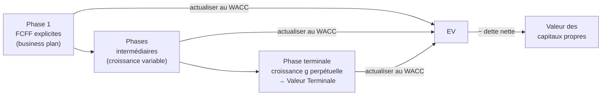

# Valorisation DCF multi-étapes (FCFF)

La méthode **DCF (*Discounted Cash Flow*)** estime la valeur d'une entreprise comme la somme actualisée des flux de trésorerie qu'elle générera. Quand on actualise les **Free Cash Flows to the Firm (FCFF)** au **WACC**, on obtient la valeur de l'actif économique (*Enterprise Value*), dont on déduit la dette nette pour atteindre la valeur des capitaux propres.

## 1. Le FCFF : le flux à actualiser

Le FCFF est le flux disponible pour **l'ensemble des apporteurs de capitaux** (créanciers + actionnaires), avant rémunération de la dette :

$$
FCFF = EBIT \times (1 - T_c) + D\&A - \Delta NWC - CapEx
$$

On l'actualise au **WACC** parce que ce taux mélange le coût des deux sources de financement, exactement comme le FCFF rémunère les deux.

## 2. Le WACC : le taux d'actualisation

$$
WACC = \frac{E}{V}\,R_e + \frac{D}{V}\,R_d\,(1 - T_c)
$$

Le coût des fonds propres vient du **CAPM** :

$$
R_e = R_f + \beta_e \,\big(E(R_m) - R_f\big)
$$

où la prime de risque de marché \(MRP = E(R_m) - R_f\). Le coût de la dette après impôt, \(R_d(1-T_c)\), intègre l'**économie d'impôt** : les intérêts sont déductibles, ce qui abaisse le coût effectif de la dette.

!!! warning "Pondérations en valeur de marché"
    Les poids \(E/V\) et \(D/V\) se calculent en **valeur de marché** (souvent un ratio cible de levier), jamais en valeur comptable. C'est un point d'examen classique.

## 3. La logique multi-étapes

On ne peut pas prévoir les flux à l'infini. On découpe donc l'avenir en **phases**, puis on referme le modèle par une **valeur terminale** qui capitalise la dernière phase en croissance perpétuelle (modèle de Gordon) :

$$
TV_n = \frac{FCFF_{n+1}}{WACC - g} = \frac{FCFF_n\,(1+g)}{WACC - g}
$$

La valeur d'entreprise est la somme des flux explicites actualisés **plus** la valeur terminale actualisée :

$$
EV = \sum_{t=1}^{n} \frac{FCFF_t}{(1+WACC)^t} + \frac{TV_n}{(1+WACC)^n}
$$

!!! danger "Le piège de l'actualisation de la valeur terminale"
    La valeur terminale \(TV_n\) est calculée **en date \(n\)** (fin de la dernière année explicite). Il faut donc l'actualiser sur \(n\) périodes, pas \(n+1\). C'est l'erreur la plus fréquente.

## 4. Du EV à la valeur des capitaux propres

$$
\text{Valeur des capitaux propres} = EV - \text{Dette nette}
$$

Le prix par action s'obtient en divisant par le nombre d'actions. Pour une IPO ou une privatisation, c'est ce montant qui fonde le **prix de marché** proposé.

## 5. Cas GATOR Gmbh (3 étapes, IPO)

GATOR vise une IPO. Business plan : \(FCFF_1 = 10\), \(FCFF_2 = 12\), \(FCFF_3 = 14\) (m USD), puis croissance perpétuelle \(g = 3\%\). \(\beta_e = 1{,}5\), \(R_f = 2\%\), \(MRP = 6\%\), YTD dette \(= 5\%\) avant impôt, levier cible \(D/V = 30\%\), \(T_c = 35\%\), dette nette \(= 40\) m USD.

**Étape 1 — coûts du capital.**

$$
R_e = 2\% + 1{,}5 \times 6\% = 11\% \qquad R_d(1-T_c) = 5\% \times (1-0{,}35) = 3{,}25\%
$$

$$
WACC = 0{,}70 \times 11\% + 0{,}30 \times 3{,}25\% = 8{,}675\%
$$

**Étape 2 — valeur terminale.** \(FCFF_4 = 14 \times 1{,}03 = 14{,}42\), donc

$$
TV_3 = \frac{14{,}42}{0{,}08675 - 0{,}03} = 254{,}10 \text{ m USD}
$$

**Étape 3 — actualisation.**

| Année | Flux | Facteur \(1/(1{+}WACC)^t\) | Valeur actuelle |
|------:|-----:|--------------------------:|----------------:|
| 1 | 10,00 | 0,9202 | 9,20 |
| 2 | 12,00 | 0,8468 | 10,16 |
| 3 | 14,00 | 0,7793 | 10,91 |
| TV (t=3) | 254,10 | 0,7793 | 197,98 |
| | | **EV** | **228,25** |

**Étape 4 — capitaux propres.**

$$
\text{Valeur des capitaux propres} = 228{,}25 - 40 = 188{,}25 \text{ m USD}
$$

C'est le prix de marché qu'on peut proposer pour l'IPO.

## 6. Créez-vous de la valeur dans la dernière phase ?

La croissance soutenable relie ROE et taux de rétention : \(g = ROE \times (1 - \text{payout})\). Avec un payout de 80 % et \(g = 3\%\) :

$$
ROE = \frac{g}{1 - \text{payout}} = \frac{3\%}{0{,}20} = 15\%
$$

Comme \(ROE = 15\% > R_e = 11\%\), l'entreprise génère un rendement supérieur au coût de ses fonds propres : **elle crée de la valeur** dans la phase terminale. Si \(ROE\) avait été inférieur à \(R_e\), la croissance aurait *détruit* de la valeur — croître n'est créateur de valeur que si le rendement dépasse le coût du capital.

## 7. Manipuler le modèle

Le widget ci-dessous applique cette mécanique : entre les FCFF explicites, les paramètres de coût du capital et la croissance terminale, et observe comment l'EV et la valeur des capitaux propres réagissent. Les valeurs par défaut reproduisent le cas GATOR.

<iframe src="../../widgets/multistage-dcf.html" width="100%" height="640" style="border:0; border-radius:8px;" loading="lazy"></iframe>

!!! note "Vers le cas DEGUELLAR (4 étapes)"
    Le cas émergent ajoute une phase de croissance à 10 % puis une phase de décélération (−1 %/an), et un *country risk spread* de 5 % qui s'ajoute au taux sans risque. La logique reste identique : davantage de phases explicites avant la valeur terminale. Le widget gère un nombre quelconque de flux explicites.
