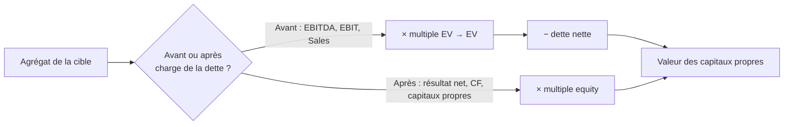

# Valorisation par multiples & comparables

La valorisation par multiples est une approche **analogique** (ou *relative*) : au lieu d'actualiser des flux futurs comme le DCF, on valorise la cible par comparaison avec des sociétés semblables déjà cotées ou transigées. Le principe tient en une ligne :

$$
\text{Valeur} = \text{Multiple} \times \text{agrégat comptable}
$$

On observe le multiple (par exemple EV/EBITDA) sur un échantillon de comparables, puis on l'applique à l'agrégat correspondant de la cible. C'est rapide et ancré dans le marché — mais la qualité dépend entièrement de la pertinence de l'échantillon.

## 1. EV vs equity : ne jamais mélanger numérateur et dénominateur

C'est la règle qui structure tout. Un multiple doit être **cohérent** : un agrégat *avant* charge de la dette (donc revenant à tous les apporteurs de capitaux) se rapporte à la valeur d'entreprise (EV) ; un agrégat *après* charge de la dette (revenant aux seuls actionnaires) se rapporte à la valeur des capitaux propres.

| Type | Multiples | Agrégat | Donne |
|------|-----------|---------|-------|
| Multiples de **valeur d'entreprise** | EV/Sales, EV/EBITDA, EV/EBIT | avant intérêts | EV → puis − dette nette = capitaux propres |
| Multiples de **capitaux propres** | PER, P/CF, P/B | après intérêts | directement la valeur des capitaux propres |

## 2. Quel multiple choisir ?

**Multiples d'EV.** Le multiple de **chiffre d'affaires** (EV/Sales) ne sert qu'en dernier recours (rien d'autre de disponible, ou secteurs sous quota), car il suppose une marge normative. Le multiple d'**EBITDA** élimine l'effet des politiques d'amortissement, mais repose sur un niveau normatif de capital employé. Le multiple d'**EBIT** intègre l'amortissement du capital employé : c'est le **plus fiable** selon Verdié.

**Multiples de capitaux propres.** Le **PER** (résultat net hors éléments non récurrents, hors minoritaires) est le critère classique. Le **P/CF** (résultat net consolidé avant amortissements) est surtout utilisé dans le pétrole. Le **P/B** (Price to Book) sert à valoriser les institutions financières, dont l'activité est pilotée par les capitaux propres.

!!! warning "Le piège du PER"
    Le PER intègre une **structure de capital implicite** : il « embarque » le niveau d'endettement des comparables. Si la cible a un levier très différent, le PER peut induire en erreur, là où un multiple d'EBIT — neutre vis-à-vis du financement — reste comparable. En contrepartie, le PER capte la contribution des sociétés mises en équivalence, les intérêts minoritaires et la situation fiscale de la cible.

## 3. Les déterminants (*drivers*) des multiples

Un multiple n'est pas un chiffre magique : il reflète trois forces économiques. Comprendre ces *drivers* permet de juger si un multiple observé est justifié.

| Driver | Effet sur le multiple |
|--------|----------------------|
| **Taux d'intérêt** | Taux élevés → multiples bas ; taux bas → multiples élevés |
| **Risque** (opérationnel + financier) | Risque élevé → multiple bas ; la sensibilité dépend de la structure de capital |
| **Anticipations de croissance** | Croissance forte → multiple élevé |

Ces forces se lisent explicitement dans le PER. Sans croissance (cadre Modigliani-Miller), le PER n'est que l'inverse du coût des fonds propres :

$$
PER = \frac{1}{r_e}
$$

Avec une croissance régulière (modèle de Gordon-Shapiro) :

$$
PER = \frac{d\,(1+g)}{r_e - g}
$$

où \(d\) est le taux de distribution (*payout*) et \(g\) la croissance nominale de long terme. On retrouve les trois *drivers* : un \(r_e\) élevé (taux et risque élevés) écrase le PER, une croissance \(g\) élevée le gonfle.

## 4. Construire l'échantillon de comparables

C'est le cœur méthodologique. Les comparables doivent partager les *drivers* de valorisation :

- **Même risque** : risque opérationnel (position concurrentielle, visibilité) et risque financier (structure de capital comparable à la cible).
- **Mêmes perspectives de croissance** : la croissance anticipée des résultats varie énormément d'une firme à l'autre.
- **Mêmes facteurs géographiques** : cycles d'activité, structure de marge (coût du travail, fiscalité), habitudes commerciales (BFR), options de financement (*gearing*), taux d'intérêt, principes comptables.
- **Mêmes principes comptables** : amortissement du goodwill, immobilisations incorporelles (R&D), éléments exceptionnels, provisions (retraites), contrats long terme.

!!! tip "Insight de Verdié"
    Les meilleurs comparables ne sont **pas nécessairement les plus évidents**. Une société du même secteur mais au profil de risque ou de croissance différent est un mauvais comparable ; une société d'un autre secteur au profil économique identique peut être meilleure.

Un point sur le **cours de Bourse** : utiliser le prix spot comme référence n'a de sens qu'en **marché efficient**, ce qui suppose une liquidité suffisante, une couverture par les analystes financiers et une communication financière de qualité.

## 5. Appliquer la méthode

Le widget ci-dessous calcule la valeur implicite de la cible à partir d'un multiple de comparables. Choisis le type de multiple, entre l'agrégat de la cible et la fourchette de multiples observée chez les pairs (bas / médian / haut), et lis la fourchette de valeur des capitaux propres qui en résulte — exactement la démarche attendue sur un cas type (recherche des multiples pertinents pour un groupe comparable via une base comme InfrontAnalytics).

<iframe src="../../widgets/comparables-valuation.html" width="100%" height="600" style="border:0; border-radius:8px;" loading="lazy"></iframe>

!!! note "DCF et multiples sont complémentaires"
    Verdié insiste : on utilise **les deux**. Le DCF donne une valeur intrinsèque fondée sur les flux ; les multiples donnent une valeur de marché relative. Leur écart est en soi une information (la cible est-elle chère ou non par rapport à ses pairs ?).
