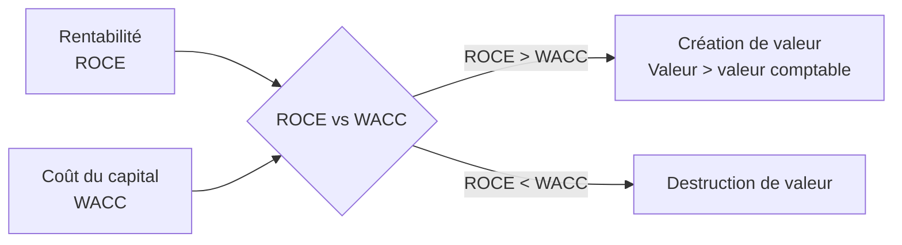
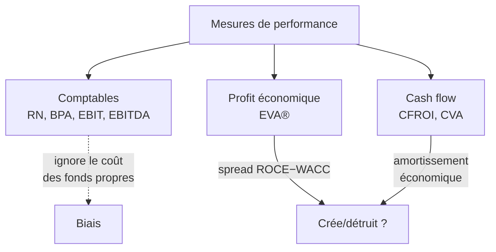

# Création de valeur : EVA® & MVA

La Partie 2 du cours répond à une question que la comptabilité seule ne sait pas trancher : **un manager a-t-il créé de la richesse ?** Le problème central est que les mesures comptables de profit (résultat net, BPA, EBIT, EBITDA) ne reflètent pas forcément la rentabilité *économique* d'une année donnée — parce qu'elles **ignorent le coût des capitaux propres**. Deux outils corrigent ce biais : la MVA (regard de marché) et l'EVA® (regard interne).

## 1. L'idée fondatrice : profit comptable ≠ profit économique

Une entreprise ne crée de la valeur que si elle gagne **plus que le coût de tout le capital** qu'elle mobilise, fonds propres compris. Gagner un résultat positif ne suffit pas : encore faut-il battre le rendement qu'exigent les apporteurs de capitaux pour le risque pris.

L'exemple le plus parlant du cours compare deux entreprises :

| | Société A | Société B |
|---|---:|---:|
| Résultat | 150 | 300 |
| Actif économique | 1 500 | 3 500 |
| Rentabilité (Résultat / Actif) | **10 %** | 8,6 % |
| Coût du capital | 12 % | 8 % |
| Charge en capital (Actif × coût) | 180 | 280 |
| **Création de valeur** | **−30** | **+20** |

A est *comptablement* plus rentable (10 % > 8,6 %), mais elle **détruit** de la valeur car son coût du capital (12 %) dépasse sa rentabilité. B, moins rentable en apparence, **crée** de la valeur. La leçon : la rentabilité ne se juge jamais dans l'absolu, toujours **par rapport au coût du capital**.

## 2. MVA — Market Value Added (le regard du marché)

La MVA mesure la richesse créée comme l'écart entre la valeur de marché de la firme et le capital qui y a été investi :

$$
MVA = \text{Valeur de la firme} - \text{Capital investi}
$$

Côté actionnaires, en prenant la valeur comptable de la dette comme approximation de sa valeur de marché :

$$
MVA = \text{Capitalisation boursière} - \text{Capitaux propres comptables}
$$

**Exemple Occidental Petroleum (OXY).** Cours 29,25 $/action, 341,126 millions d'actions, capitaux propres comptables 3,109 Md$ :

$$
MVA = 29{,}25 \times 341{,}126 - 3\,109 = 9\,979 - 3\,109 \approx 6{,}87 \text{ Md USD}
$$

Le marché valorise la firme près de 6,9 Md$ au-dessus du capital apporté : c'est la valeur créée, telle qu'anticipée par les investisseurs.

## 3. EVA® — Economic Value Added (le regard interne)

L'EVA® (marque de Stern Stewart) est le profit opérationnel après impôt **diminué de la charge de tout le capital employé** :

$$
EVA = \underbrace{EBIT\,(1-T)}_{NOPAT} - WACC \times \text{Capital employé}
$$

De façon équivalente, en faisant apparaître la rentabilité économique \(ROCE = NOPAT / \text{Capital employé}\) :

$$
EVA = (ROCE - WACC) \times \text{Capital employé}
$$

Cette seconde forme est la plus éclairante : l'EVA est le **spread** (ROCE − WACC) appliqué au capital. Positive si l'entreprise gagne plus que son coût du capital.

**Exemple OXY.** EBIT 962 M$, impôt 32,3 %, WACC 10,1 %, capital investi 6,761 Md$ :

$$
NOPAT = 962 \times (1 - 0{,}323) = 651 \text{ M\$} \qquad \text{charge en capital} = 0{,}101 \times 6\,761 = 683 \text{ M\$}
$$

$$
EVA = 651 - 683 = -32 \text{ M USD}
$$

Cette année-là, malgré un profit comptable positif, OXY **détruit** environ 32 M$ de valeur économique : son ROCE (≈ 9,6 %) est inférieur à son WACC (10,1 %).

!!! tip "ROA/ROCE vs WACC, en une phrase"
    Si **ROCE > WACC**, alors la valeur financière (de marché) dépasse la valeur comptable → création de valeur. C'est le critère unique qui relie rentabilité, coût du capital et valeur.

## 4. Le pont entre EVA et MVA

EVA et MVA ne sont pas deux mondes : la **MVA est la valeur actuelle des EVA futures**.

$$
MVA = \sum_{t=1}^{\infty} \frac{EVA_t}{(1+WACC)^t}
$$

Autrement dit, la valeur de marché de l'actif économique = valeur comptable + somme actualisée des profits économiques futurs. C'est ce qui rend l'EVA® théoriquement cohérente avec la finance moderne et explique sa corrélation empirique avec la MVA. C'est aussi pourquoi l'EVA sert à piloter la performance d'unités d'affaires : elle est décomposable, là où une MVA globale ne l'est pas.

## 5. Limites de l'EVA® et mesures en cash : CFROI & CVA

L'EVA® a trois limites importantes : elle ne mesure que les **actifs en place** (mal adaptée aux firmes à fortes opportunités de croissance) ; c'est une mesure **court-termiste** (il faut analyser ses *variations*, pas son niveau) ; et elle est sensible aux **retraitements comptables** (selon PwC, plus de 160 façons de la calculer).

Le cours introduit alors les mesures en *cash flow*. Le piège qu'elles corrigent : FCF, ROIC et EVA reposant sur la **valeur comptable** du capital investi peuvent signaler une création (ou destruction) de valeur fictive. Sur un projet dont la VAN est exactement nulle, ces mesures se trompent. La solution passe par l'**amortissement économique** (ED) — la dotation annuelle qui, placée dans un fonds amortisseur rémunéré au WACC, reconstitue exactement le capital à remplacer en fin de vie :

$$
CVA = CF - ED - WACC \times IC = (CFROI - WACC) \times IC \qquad \text{avec } CFROI = \frac{CF - ED}{IC}
$$

Sur le projet à VAN nulle, la CVA ressort à **0 chaque année** : elle reflète correctement le fait que le projet rapporte tout juste le coût du capital, là où les mesures comptables se laissaient abuser.

## 6. Synthèse des mesures de valeur

Le widget ci-dessous calcule l'EVA et le spread (ROCE − WACC) à partir de l'EBIT, du taux d'impôt, du WACC et du capital investi. Les valeurs par défaut reproduisent le cas OXY.

<iframe src="../../widgets/eva-calculator.html" width="100%" height="560" style="border:0; border-radius:8px;" loading="lazy"></iframe>

!!! note "À retenir pour l'examen"
    Conclusions du cours : ne pas abuser du levier ; la valeur est relative (DCF **et** multiples) ; implémenter le *Value Based Management* pour optimiser la création de valeur ; utiliser les nouveaux indicateurs (EVA, CVA) plutôt que les seuls indicateurs comptables.
