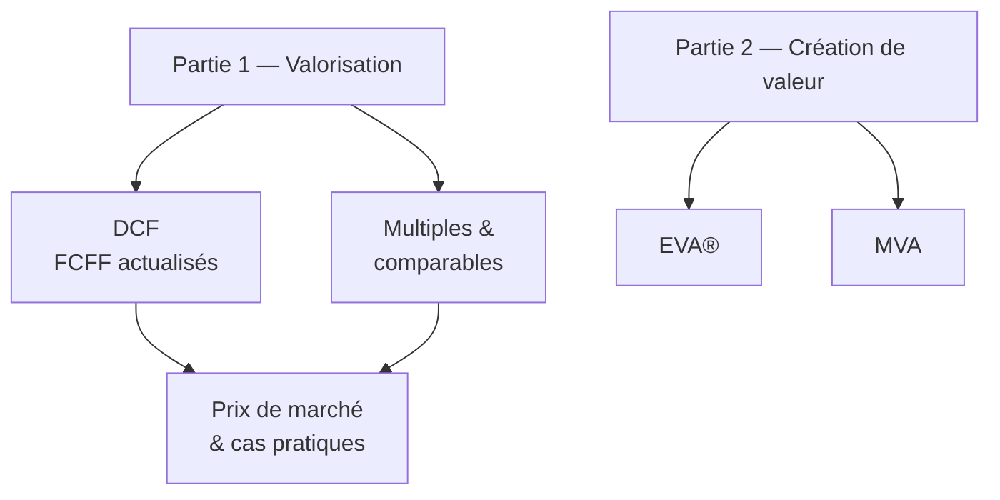

# Corporate Valuation — Vue d'ensemble

Cours du Dr. Jean-François Verdié (*Advanced Finance — Corporate Valuation*). Objectif : choisir et utiliser les méthodes de valorisation les plus courantes pour estimer la valeur d'une entreprise, et mesurer la création de valeur.

## Plan du cours

| Bloc | Notions centrales |
|------|-------------------|
| Pré-requis | États financiers, NPV/IRR, perpétuités, CAPM & WACC, FCFF, Modigliani-Miller, valeur d'une obligation, bases des options |
| DCF | Free Cash Flow to the Firm, WACC, valeur terminale, modèles multi-étapes (2, 3, 4 stades) |
| Multiples | EV/EBITDA, EV/EBIT, P/E, P/B, sociétés comparables |
| Création de valeur | EVA® (Economic Value Added), MVA (Market Value Added), lien avec ROE et coût du capital |
| Cas pratiques | GATOR Gmbh (3 stades, IPO), DEGUELLAR Empresa (4 stades, marché émergent) |

!!! tip "Ressource"
    Un glossaire de *creative accounting* accompagne ce cours et sera intégré comme page de référence transverse.

La première page de profondeur — **valorisation DCF multi-étapes** — est disponible et traite intégralement le cas GATOR.
