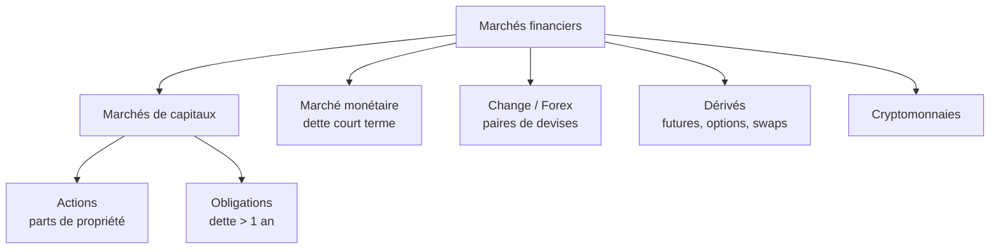
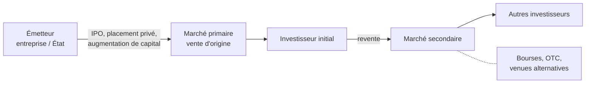

# 1. Actifs & marchés

Ce premier chapitre pose le décor : qu'est-ce qu'un actif financier, quels marchés existent, qui y intervient et à quoi ils servent.

## Actifs réels vs actifs financiers

Un **actif réel** — tangible ou intangible (ressources naturelles, capital physique, capital humain, propriété intellectuelle) — tire sa valeur de sa substance propre. Un **actif financier** tire sa valeur d'une **créance contractuelle** sur un actif sous-jacent : il ne produit rien par lui-même, il représente un droit. Trois caractéristiques le définissent : **divisibilité**, **liquidité**, **standardisation**.

## Les grands types d'actifs financiers

| Classe | Profil |
|--------|--------|
| Cash & équivalents | Très liquide, risque très faible |
| Dette (*fixed income*) | Intérêt régulier, risque de crédit variable, volatilité < actions |
| Actions (*equity*) | Potentiel de rendement élevé, volatilité élevée, propriété + droits de vote |
| Dérivés | Valeur dérivée d'un sous-jacent |

## Les grands types de marchés

Le **marché actions** sert à échanger des parts de propriété d'entreprises cotées ; le **marché obligataire** porte la dette long terme (> 1 an) des entreprises et États ; le **marché monétaire** traite la dette court terme (États, banques, entreprises) et c'est là qu'opèrent les banques centrales. S'y ajoutent le **change**, les **dérivés** (y compris dérivés de matières premières) et les **cryptomonnaies**.

## Les participants

Corporations (acteur central : émettent actions et obligations), investisseurs **retail** (capacité d'épargne, en direct ou via gérants), investisseurs **institutionnels** (fonds, assureurs, hedge funds), **banques** (dépôts court terme / prêts long terme), **États** (emprunt/prêt, émissions obligataires), **banques centrales** (marché monétaire), et les autres maillons : agences de notation, régulateurs, chambres de compensation, bourses, plateformes, dépositaires.

## Les fonctions des marchés

Quatre fonctions économiques structurantes :

- **Financer l'économie** : transférer les fonds des agents en capacité d'épargne vers ceux en besoin de financement ; fournir liquidité et capital aux entreprises, États, banques.
- **Fixer les prix des actifs** (*asset pricing*) : les prix de marché servent de signaux pour l'allocation des ressources et les décisions d'investissement.
- **Communiquer l'information** : les prix reflètent et agrègent l'information disponible.
- **Partager le risque** : diversification, exposition à différentes classes de risque, assurance.

!!! note "Lien avec l'économie réelle"
    Les marchés permettent l'allocation des ressources dans le temps, la séparation propriété/gestion (donc la diversification), et une allocation efficace du capital. Leur défaillance peut provoquer récession et chômage : ils sont indissociables de l'économie réelle. Question d'examen classique : *« les marchés financiers sont séparés de l'économie réelle »* est **faux**.

## Marché primaire vs secondaire

Le **marché primaire** est celui de la vente d'origine, directement par l'émetteur (IPO, placements privés, augmentations de capital). Le **marché secondaire** est celui où les investisseurs s'échangent les titres entre eux (bourses officielles, OTC, venues alternatives).

!!! tip "Point d'examen"
    Vendre, trois ans après une IPO, des actions achetées lors de cette IPO = transaction sur le **marché secondaire**. Acheter une obligation d'État dans l'inventaire d'un *dealer* = actif financier sur le **marché secondaire**. Le critère est : échange entre investisseurs (secondaire) vs émission par l'émetteur (primaire).
