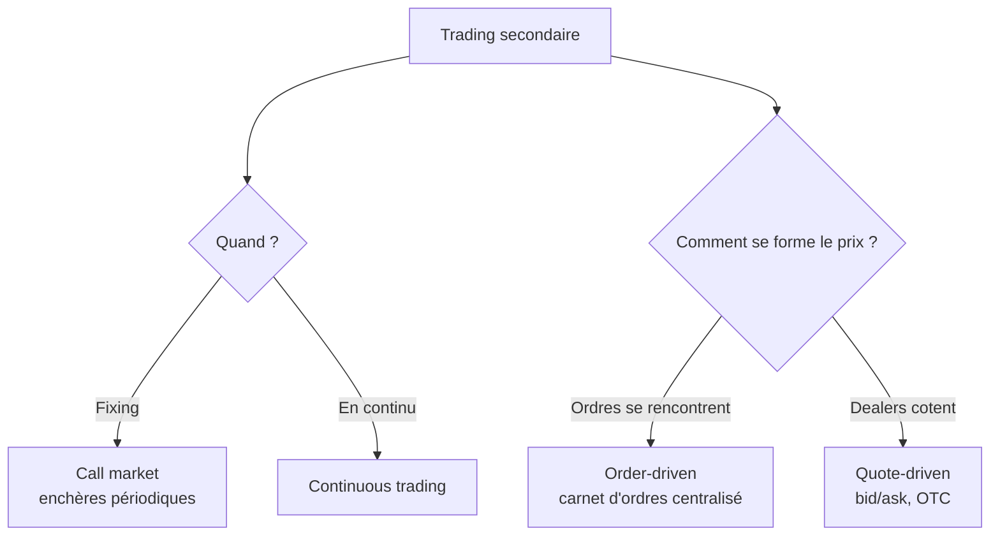
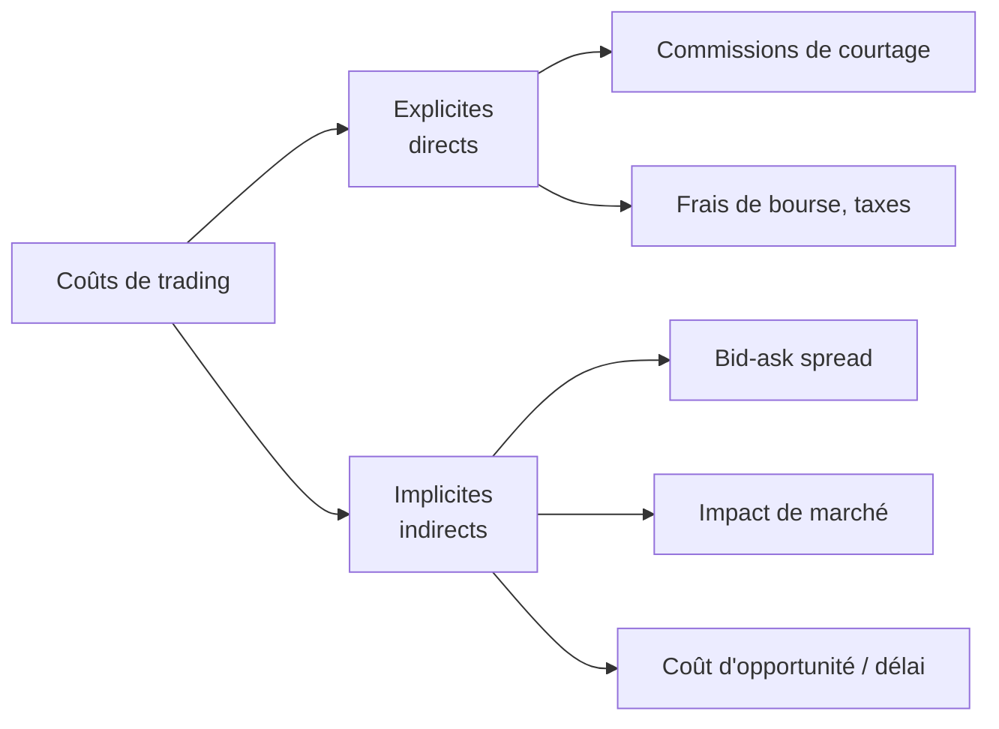

# 2. Microstructure & trading

Comment, concrètement, un ordre devient une transaction ? Ce chapitre couvre la **microstructure** : structures de marché, lieux d'exécution, carnet d'ordres, types d'ordres, coûts et régulation.

## Structure de marché : la définition

La structure de marché est définie par les **règles** et les **systèmes** de négociation. Elle détermine ce qui peut être traité, qui peut trader, quand, où, comment, et quelle information est disponible. Une même action (ex. BNP Paribas) se négocie sur sa cotation primaire (Euronext Paris) **et** sur des venues alternatives (Cboe Europe, Xetra, Liquidnet…) : les structures coexistent.

## Qualité d'un marché

Trois dimensions clés :

- **Liquidité** — la facilité à traiter vite, à un prix proche de la valeur de consensus : spread serré, exécution immédiate, carnet profond, faible impact prix.
- **Découverte des prix** (*price discovery*) — vitesse et précision avec lesquelles les prix intègrent l'information.
- **Volatilité** — fondamentale (réaction à l'information) vs transitoire (liée à l'activité de traders non informés).

!!! note "Pourquoi ça compte"
    Illiquidité → coûts de transaction plus élevés → rendement net plus faible → les investisseurs exigent davantage → **coût du capital plus élevé** pour les entreprises. Une découverte des prix lente fausse les choix de portefeuille et d'investissement réel : l'allocation des ressources n'est plus optimale.

## Modes d'organisation

Marchés **order-driven** (centralisés, carnet d'ordres, typiques des actions/futures/options) où les ordres d'achat et de vente se rencontrent selon des règles d'appariement ; marchés **quote-driven** (décentralisés, *dealers* qui affichent un **bid** et un **ask**, typiques des obligations, devises, matières premières au comptant). Le **bid/ask spread** est la différence entre le prix auquel le dealer achète (bid) et vend (ask).

## Lieux d'exécution

- **Bourses** : marchés hybrides (enchères + continu), structurés en carnets d'ordres électroniques (NYSE, Euronext, LSE). Aujourd'hui sociétés cotées à but lucratif (autrefois coopératives de membres). Elles fournissent cotation/*listing* (exigences strictes), services de transaction (frais, *maker-taker*), systèmes haute vitesse, sauvegardes (*circuit breakers*, *trading halts*) et données de marché.
- **Brokers** : intermédiaires agissant **pour le compte** des clients, ne prennent **pas** de risque de marché (ne détiennent pas les titres), rémunérés par commission. Retail (*full service* ou *discount*/en ligne), *prime brokers* pour institutionnels, marchés *brokered* (blocs, actifs uniques).
- **Dealers** : **contrepartie** des clients, **font le marché** (affichent bid/ask), prennent un **risque de marché** (inventaire exposé aux fluctuations), se rémunèrent sur le spread. Les *broker-dealers* font les deux ; l'**internalisation** (MiFID II : *Systematic Internalisers*) exécute les ordres clients en interne, hors marché réglementé.
- **Venues alternatives** : **ATS** (US, SEC) et **MTF** (Europe, MiFID II), souvent moins transparentes. Les **dark pools** ne montrent pas le carnet (gros ordres institutionnels, faible impact prix) ; les **ECN** apparient automatiquement et offrent exécution rapide à faible coût.

!!! tip "Point d'examen"
    Liquidnet n'est **pas** une bourse officielle (c'est une venue alternative). Comparées aux bourses, les ATS peuvent être **moins transparentes**.

## Fragmentation et transparence

En marché **consolidé**, tout se passe au même endroit ; en marché **fragmenté** (actions US et européennes), le trading se disperse sur de multiples carnets. La cotation primaire n'a pas le monopole. On recrée une consolidation virtuelle via systèmes d'information, d'accès, de routage et la *consolidated tape*. La **transparence pré-trade** porte sur les ordres affichés (offre/demande), la **post-trade** sur les transactions. Trop de transparence peut nuire : comment un investisseur informé survit-il si tout est visible ? D'où les mécanismes *dark* (ordres cachés, internalisés).

## Le carnet d'ordres (LOB) et les types d'ordres

Le **carnet d'ordres** (*Limit Order Book*) recense les ordres à cours limité non encore exécutés. Sa liquidité repose sur la coexistence de deux types d'ordres :

| Ordre | Logique | Risque |
|-------|---------|--------|
| **Ordre au marché** | Exécution immédiate, prix subi | *slippage* ; on paie le spread (coût de l'immédiateté) |
| **Ordre à cours limité** | On fixe le prix (on « fait » le spread), on attend dans le carnet | Non-exécution, sélection adverse ; le spread rémunère ces risques |

Un **ordre à cours limité marketable** (achat au-dessus de l'ask, vente sous le bid) s'exécute immédiatement, tout en bornant le prix — utile sur les valeurs volatiles.

!!! tip "Market-maker vs market-taker"
    Si vous placez un bid/ask qui **n'exécute pas** immédiatement (il rejoint le carnet et offre de la liquidité), vous êtes **market-maker**. Si vous prenez la liquidité existante, vous êtes market-taker.

**Règles de priorité** : prix (les prix les plus agressifs d'abord), puis temps (premier arrivé), puis visibilité (ordres affichés avant cachés), puis membre. Le **tick** est l'incrément de prix minimal : il fixe l'amélioration de prix qu'un nouvel entrant doit offrir pour gagner la priorité, et arbitre donc entre priorité-prix et priorité-temps. MiFID II harmonise les ticks selon liquidité et niveau de prix ; la SEC impose le centime.

## Compensation et règlement

Après la transaction, acheteur et vendeur confirment (automatique en électronique), puis le règlement-livraison intervient (instantané à T+3 selon les marchés). Les **chambres de compensation** s'interposent pour minimiser le risque de défaut : confirmation, surveillance des membres, exigence d'un compte de marge (dépôt initial, appels de marge).

## Coûts de trading

Le **spread absolu** \(S = a - b\) (ask − bid), le **midprice** \(m = (a+b)/2\), le **spread relatif** \(s = S/m\). Les commissions de courtage ont fortement chuté depuis les années 1970 (de ~0,9 % à 0,1 % et moins) avec l'abolition des commissions fixes et l'essor des courtiers en ligne.

!!! tip "Point d'examen"
    Affirmation **fausse** : *« les coûts de trading n'affectent pas le rendement net »*. Ils le réduisent, explicitement et implicitement.

## Régulation

**IOSCO** (1983, standard mondial des régulateurs de valeurs mobilières) et le **FSB** (stabilité financière globale) fixent le cadre. Trois objectifs : protection des investisseurs, équité/efficience/transparence des marchés, stabilité financière et réduction du risque systémique. Régulateurs nationaux : **SEC**/CFTC/FINRA (US), **FCA** (UK), **AMF** (France), **BaFin** (Allemagne). En Europe, l'**ESMA** coordonne ; **MiFID II** / **MiFIR** (2018, révision de MiFID 2007) harmonisent les marchés : stabilité, transparence (reporting, règles dark/OTC/HFT) et protection de l'investisseur (*best execution* — obtenir le meilleur résultat possible pour le client).
