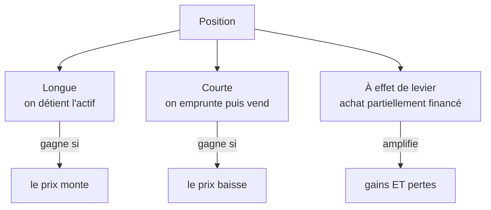

# 3. Gestion & positions

La gestion de portefeuille (*investment management*) est le processus de sélection et de pilotage d'un ensemble d'investissements. Bien plus qu'acheter et vendre : stratégie court/long terme, évaluation du risque, sélection, fiscalité, reporting — le tout pour atteindre l'objectif financier de long terme et respecter la **tolérance au risque** de l'investisseur. Principe central : chaque actif est jugé par sa **contribution au portefeuille** (approche portefeuille), pas isolément.

Les investisseurs **retail** investissent en direct ou via des gérants/banques privées ; les **institutionnels** sont les fonds (mutual funds, ETF), assureurs, fonds de pension, hedge funds. Un *asset manager* gère le portefeuille d'un client.

## Les trois types de positions

Une **position** est la quantité d'un actif détenue (ou due). Un portefeuille en compte généralement beaucoup.

- **Position longue** : on détient l'actif (actions, obligations, devises, matières premières). On clôture en vendant ; elle gagne quand les prix montent. **Perte maximale = 100 %** (l'investissement initial).
- **Position courte** (*short*) : on **emprunte** le titre, on le **vend**, puis on clôture en le **rachetant** pour le rendre au prêteur. Elle gagne quand les prix **baissent**. **Perte potentiellement illimitée** (le prix peut monter sans borne).
- **Position à effet de levier** : on achète en empruntant une partie du prix (« sur marge »). Le levier **amplifie gains et pertes**.

## Exemples chiffrés (Apple à 250 $)

**Longue** — acheter 1 000 actions à 250 $ (250 000 $). Si +10 % (275 $) : gain 25 000 $ → **+10 %**. Si −10 % (225 $) : **−10 %**.

**Courte** — emprunter et vendre 1 000 actions à 250 $. Si −10 % : on rachète à 225 $ → gain 25 000 $ → **+10 %**. Si +10 % : on rachète à 275 $ → **−10 %** (et la perte n'a pas de plafond).

**Levier** — acheter 250 000 $ d'Apple avec 100 000 $ de fonds propres et 150 000 $ empruntés (marge). Les fonds propres représentent 40 % de la position :

$$
\text{Ratio de levier} = \frac{250\,000}{100\,000} = 2{,}5
$$

Si +10 % : la position gagne 25 000 $ → rendement sur fonds propres = 25 000/100 000 = **+25 %** (moins les intérêts sur la marge). Si −10 % : **−25 %**. Le rendement sur fonds propres ≈ levier × variation de prix.

Le widget ci-dessous compare les trois positions : fais varier la variation de prix et le levier pour voir l'amplification.

<iframe src="../../widgets/positions-pnl.html" width="100%" height="560" style="border:0; border-radius:8px;" loading="lazy"></iframe>

## Gestion active vs passive

| | Gestion active | Gestion passive |
|---|----------------|-----------------|
| Objectif | Battre un *benchmark* (ou rendement absolu) | Répliquer un *benchmark* |
| Méthode | *Stock-picking*, *market-timing*, analyses fondamentale et technique | *Buy-and-hold*, trading minimal |
| Hypothèse de marché | Inefficient → surperformance possible | Efficient |
| Performance mesurée par | Rendement absolu ou relatif | Minimisation de la *tracking error* |
| Coûts | Plus élevés | Plus faibles |

!!! tip "Point d'examen"
    Prendre une position courte = **emprunter le titre puis le vendre** (pour le racheter plus tard). Ce n'est ni l'acheter, ni le prêter, ni acheter sur marge. L'*index investing* relève de la gestion **passive** : répliquer un indice, pas faire du stock-picking.
