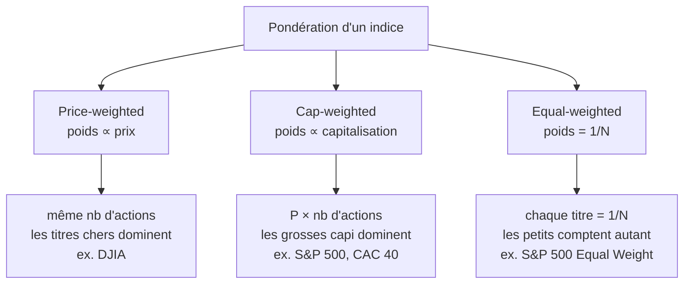

# 4. Indices & ETF

Un **indice de marché** est un portefeuille hypothétique représentant un segment du marché. Sa valeur se calcule à partir de celle de ses composants, selon des règles précises et transparentes (taille, secteur, cotation, *turnover*). Tout l'enjeu est la **méthode de pondération**, car elle change radicalement le comportement de l'indice.

## Les trois méthodes de pondération

**Price-weighted** : même nombre d'actions de chaque titre dans le panier ; le poids ne dépend que du prix, indépendamment de la taille de l'entreprise. Les titres chers dominent (ex. DJIA). **Cap-weighted** : poids proportionnel à la capitalisation (prix × nombre d'actions) ; les grandes entreprises dominent (la majorité des grands indices : S&P 500, CAC 40, Nasdaq Composite). **Equal-weighted** : chaque titre reçoit 1/N ; les petites capitalisations comptent autant que les grandes (nécessite des nombres d'actions différents pour égaliser la valeur).

### Exemple à 3 titres

Univers : A (100 $, 1 M d'actions), B (50 $, 5 M), C (20 $, 10 M).

| Méthode | Poids A | Poids B | Poids C |
|---------|--------:|--------:|--------:|
| Price-weighted (100/50/20 sur 170) | 58,8 % | 29,4 % | 11,8 % |
| Cap-weighted (100M/250M/200M sur 550M) | 18 % | 45 % | 36 % |
| Equal-weighted (1/3) | 33 % | 33 % | 33 % |

Le widget recalcule ces trois pondérations en direct — change les prix et les nombres d'actions pour voir comment chaque méthode réagit.

<iframe src="../../widgets/index-weighting.html" width="100%" height="560" style="border:0; border-radius:8px;" loading="lazy"></iframe>

La plupart des grands indices utilisent en réalité une capitalisation **ajustée du flottant** (*free-float*) : on ne pondère que les actions réellement disponibles à l'échange. Le S&P 500 (lancé en 1957, ~503 composants, rééquilibrage trimestriel) et le CAC 40 (1987, 40 composants) sont tous deux *float-adjusted market cap weighted*.

## L'investissement indiciel

Les indices servent à **mesurer** la performance d'un segment, et de **benchmark** pour les portefeuilles diversifiés. Les gérants passifs construisent un portefeuille répliquant un indice (S&P 500…). L'investissement indiciel s'est massivement développé chez les particuliers comme les institutions.

## Les ETF

Un **ETF** (*Exchange Traded Fund*) est un fonds qui met en commun l'argent des investisseurs et l'investit dans un panier de titres ; on en détient des parts **négociables en Bourse comme une action**, en continu pendant la séance. Les parts sont créées/rachetées en continu (en nature ou en cash). Par nature **passifs** (réplication d'indice), même si des ETF **actifs** cherchent désormais à battre leur benchmark.

!!! note "Une innovation majeure"
    Premier ETF : SPDR S&P 500 (**SPY**, 1993). Premier ETF européen : Lyxor CAC 40 (2001). Encours mondial (sept. 2024) : ~**14,3 trillions $**, plus de 8 000 ETF. Raisons du succès : diversification, faible coût, simplicité, transparence, liquidité — très attractif pour le retail.

## Investissements traditionnels vs alternatifs

Les investissements **traditionnels** sont les positions *long-only* en actions, obligations et cash. Les **alternatifs** regroupent les approches non traditionnelles via véhicules spéciaux (*private equity* — LBO, VC —, hedge funds, certains ETF) et les classes d'actifs anciennes comme l'immobilier et les matières premières. Leurs caractéristiques : gestion active, fort recours au **levier**, **faible corrélation** avec le traditionnel (donc diversification) — mais performance difficile à évaluer, risque de baisse, faible liquidité, moindre régulation, complexité et capital initial élevé.
