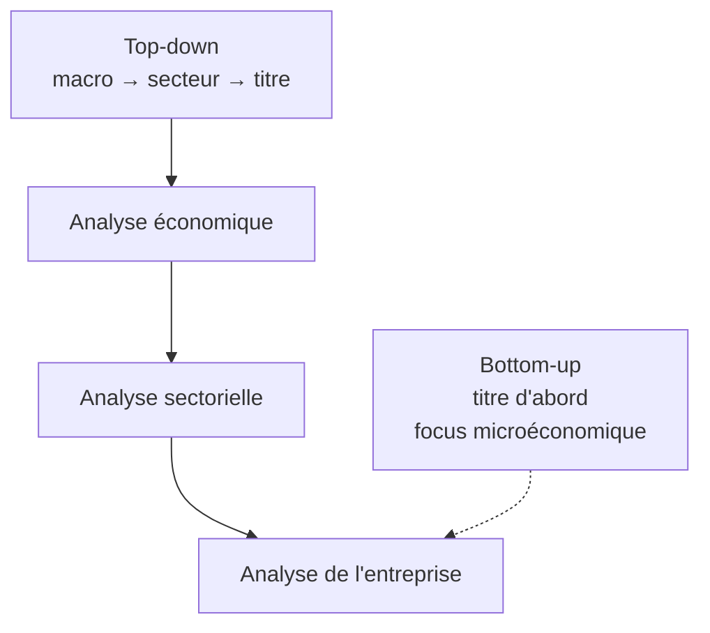

# 5. Analyse fondamentale & technique

Deux écoles s'opposent pour décider quoi acheter et quand : l'**analyse fondamentale** cherche la *valeur* d'un titre, l'**analyse technique** cherche la *direction* de son prix.

## Analyse fondamentale (FA)

La FA utilise les données financières publiques (facteurs macro et microéconomiques) pour estimer la **valeur intrinsèque** (« vraie » valeur) d'un titre, fondée sur la situation financière de l'émetteur et les conditions de marché. Hypothèse : à long terme le prix reflète les fondamentaux, mais à court terme le prix **ne reflète pas toujours** toute l'information → un titre peut être **sur-, sous- ou correctement évalué**. La FA permet de profiter des écarts entre prix et valeur intrinsèque.

Trois composantes : analyse **économique** (état général de l'économie), **sectorielle** (force d'un secteur), **d'entreprise** (performance financière de l'émetteur). Deux approches : **top-down** (du macro vers le titre) et **bottom-up** (du titre vers le haut, focus micro). Les fondamentaux sont **qualitatifs** (modèle d'affaires, avantage concurrentiel, management, gouvernance, secteur) et **quantitatifs** (états financiers : bilan, compte de résultat, tableau des flux de trésorerie).

!!! tip "Point d'examen"
    Un titre cote 50 $, votre modèle estime la valeur intrinsèque à 40 $ : il est **surévalué** → vous placeriez un ordre de **vente à découvert** (*short*).

## Analyse technique (TA)

La TA se concentre sur les données de **prix et de volume**. Postulat : l'offre et la demande déterminent prix et volumes, qui reflètent toute l'information ; les tendances et figures traduisent le **sentiment** des investisseurs et un comportement (parfois irrationnel) **qui se répète** → une certaine prévisibilité des prix. On reconnaît des figures ayant « fonctionné » par le passé pour anticiper les prix futurs.

Outils principaux : **graphiques** (lignes, barres, *candlesticks*, *point & figure*) ; **tendances, *trendlines* et canaux** ; **figures** de retournement (*head & shoulders*, double sommet) et de continuation (*cup & handle*) ; **indicateurs techniques** fondés sur prix/volume/flux. Les **moyennes mobiles** (moyenne des cours de clôture sur N périodes) lissent les fluctuations court terme et révèlent la tendance ; un croisement de la moyenne courte au-dessus de la longue signale un début de tendance haussière. Autres indicateurs cités : RSI, MACD.

## FA vs TA

| | Analyse fondamentale | Analyse technique |
|---|---------------------|-------------------|
| Objet | Données financières et économiques | Données de marché (prix, volume) |
| Cherche | Valeur intrinsèque de long terme | Direction future des prix, signaux d'achat/vente |
| Hypothèse | Le prix peut s'écarter de la valeur | Le prix reflète déjà tout, y compris les fondamentaux |

La TA suppose qu'à tout instant le prix intègre **tout** ce qui affecte l'entreprise, fondamentaux inclus. C'est précisément ce point qui sera contesté par l'efficience des marchés (chapitre suivant) : si les prix suivent une marche aléatoire, la TA perd son fondement.

!!! tip "Point d'examen"
    L'estimation de la **valeur fondamentale** d'un titre n'est **pas** un outil d'analyse technique — c'est de la FA. Affirmation **fausse** : *« les stratégies techniques sont toujours profitables en marché efficient »*.
