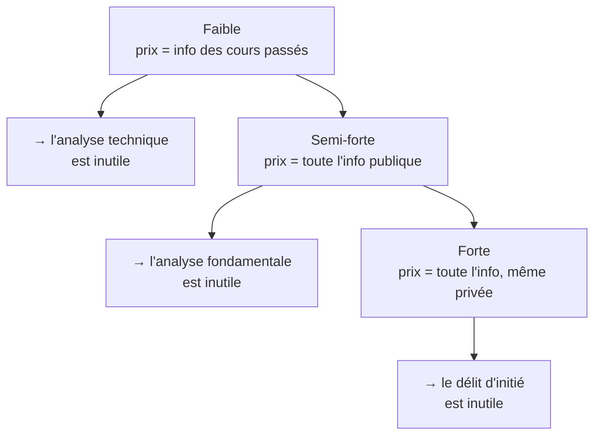

# 6. Efficience des marchés & finance comportementale

Le débat central de toute la Partie 2 : peut-on **battre le marché** ? La réponse dépend de son degré d'efficience.

## Trois sens du mot « efficience »

L'**efficience informationnelle** est celle qui structure le cours : les prix reflètent toute l'information disponible sur les valeurs fondamentales.

## L'hypothèse d'efficience des marchés (EMH)

L'**EMH** énonce que les prix reflètent pleinement toute l'information disponible. Les prix changent à l'arrivée d'**information nouvelle** ; or l'information nouvelle est par nature **imprévisible** → les variations de prix sont **imprévisibles**.

Le raisonnement : les marchés sont (quasi) parfaitement concurrentiels, donc les prix reflètent les anticipations de la valeur future ; les anticipations sont des **prévisions optimales** utilisant toute l'information (la meilleure estimation possible, pas forcément exacte *ex post*). Si un schéma de prix était prévisible, les traders l'exploiteraient jusqu'à le faire disparaître. La concurrence entre arbitragistes élimine les opportunités de profit inexploitées ; les prix réagissent vite et s'ajustent à la vraie valeur. Une mauvaise évaluation reste donc **temporaire**.

## Implication : la marche aléatoire

Si aucun schéma n'est prévisible, les rendements futurs sont **indépendants** des rendements passés : le prix suit une **marche aléatoire** (*random walk*) :

$$
Y_t = Y_{t-1} + U_t
$$

où \(U_t\) est un bruit blanc. Les variations sont aléatoires, indépendantes des précédentes, imprévisibles. **Conséquence : l'analyse technique est sans utilité** — on ne peut pas systématiquement battre le marché après coûts et risque.

Le widget ci-dessous illustre ce point déroutant : il génère une marche aléatoire (style « pile +3 % / face −2,5 % ») qui **semble** dessiner des tendances et des figures, alors qu'elle est totalement imprévisible. Le nuage \(R_t\) contre \(R_{t-1}\) montre une corrélation proche de zéro — exactement ce qu'on observe sur le S&P 500.

<iframe src="../../widgets/random-walk.html" width="100%" height="600" style="border:0; border-radius:8px;" loading="lazy"></iframe>

## Les trois formes d'efficience

| Forme | Information intégrée | Test | Rend inutile |
|-------|----------------------|------|--------------|
| **Faible** | Historique des prix | Corrélation sérielle, règles de trading | Analyse technique |
| **Semi-forte** | Toute l'information publique | Études d'événements, performance des gérants | Analyse fondamentale |
| **Forte** | Information publique **et privée** | Recommandations d'analystes, performance des fonds | Délit d'initié |

!!! tip "Points d'examen"
    Selon l'EMH : *les prix reflètent pleinement toute l'information disponible*. Absence de corrélation sérielle des variations de prix → preuve de la forme **faible**. Un investisseur tirant des rendements anormaux de l'analyse de rapports comptables **publics** contredit la forme **semi-forte**. En marché semi-fort, mieux vaut investir dans un **ETF répliquant un indice** que tenter de battre le marché.

## Le paradoxe de l'efficience

Si tous les marchés étaient parfaitement efficients, même les meilleurs traders ne pourraient jamais battre le marché → certains abandonneraient → les marchés deviendraient *moins* efficients. Inversement, des marchés trop inefficients attireraient de nouveaux traders → les rendant *plus* efficients. L'efficience est donc un **équilibre dynamique**, jamais parfait.

## Les preuves empiriques

Les premières études trouvaient des stratégies techniques rentables, mais souffraient de biais (*data snooping*, sélection *ex post* des règles, estimation du risque et des coûts, *data mining*). Les travaux plus récents confirment, dans la plupart des cas, l'efficience **faible et semi-forte** : prix imprévisibles, stratégies techniques non gagnantes après coûts/risque, gérants et analystes ne battant pas le marché en moyenne, et performance passée ne prédisant pas la performance future.

## Anomalies et finance comportementale

Il existe néanmoins des **anomalies** (déviations de l'efficience) : effets calendaires (effet janvier, *sell in May*), *earnings announcement puzzle*, effets de taille/secteur, *excess volatility*, bulles (Tulipes 1637, dot-com fin 1990s, immobilier 2007), krachs. Restent-elles fiables et exploitables ? Pas sûr.

La **finance comportementale** explique ces anomalies que l'efficience ne peut justifier. Là où l'EMH suppose des investisseurs **rationnels** et **aucune limite à l'arbitrage**, elle étudie l'influence de la **psychologie** sur le comportement des investisseurs : surconfiance, aversion aux pertes, conservatisme, mimétisme (*herding*)…

!!! tip "Point d'examen"
    L'idée de la finance comportementale : un comportement **non rationnel** aide à expliquer les phénomènes et anomalies de marché (et non : les investisseurs sont toujours rationnels, ou les marchés toujours efficients).
