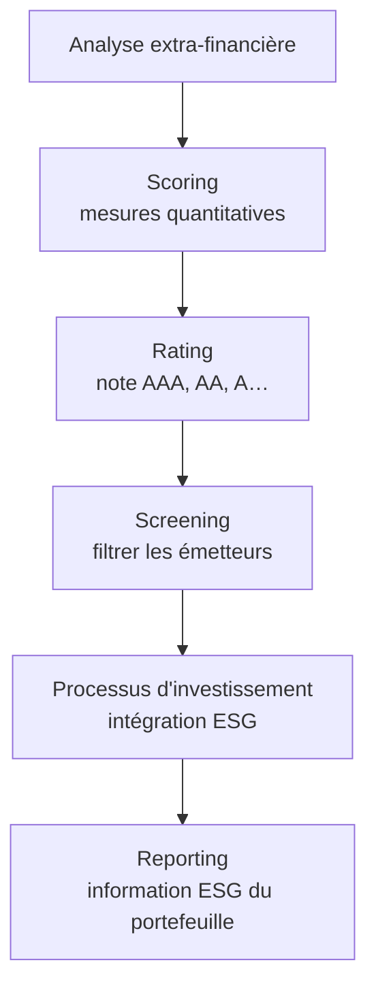
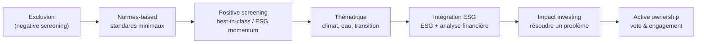
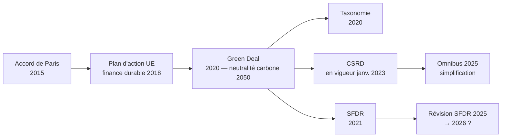

# 7. Finance durable & ESG

La finance « traditionnelle » vise la **maximisation de la valeur**. La finance durable y ajoute une exigence : intégrer les facteurs **environnementaux, sociaux et de gouvernance (ESG)** aux décisions d'investissement. La Commission européenne la définit comme « la finance qui soutient la croissance économique tout en réduisant les pressions sur l'environnement et en tenant compte des aspects sociaux et de gouvernance ». De plus en plus d'investisseurs veulent que leur argent soit **profitable *et* aligné** sur leurs valeurs.

## Les dimensions de l'investissement ESG

L'**analyse** intègre des facteurs non financiers pour repérer risques et opportunités (modélisation du risque climatique, intégration ESG à l'analyse fondamentale). Le **scoring** quantifie les dimensions ESG ; le **rating** en tire une note (AAA, AA, A…) ; le **screening** filtre les émetteurs ; le **processus** définit comment l'ESG entre dans la sélection ; le **reporting** communique les mesures ESG du portefeuille.

## Les critères ESG

| Environnement | Social | Gouvernance |
|---------------|--------|-------------|
| Énergie, pollution, déchets | Droits humains, travail des enfants | Qualité du management |
| Changement climatique, émissions | Normes de travail, santé/sécurité | Composition et indépendance du conseil |
| Bien-être animal, biodiversité | Satisfaction client, données/vie privée | Transparence, rémunération des dirigeants, corruption |

## Les stratégies d'investissement durable

- **Exclusion / negative screening** : exclure entreprises, secteurs ou pays violant des principes ESG (émetteurs notés CCC, secteur énergie, charbon…).
- **Normes-based screening** : filtrer selon des standards internationaux minimaux (armement, nucléaire, charbon thermique, tabac, alcool, jeux, OGM…).
- **Positive screening** : investir dans les meilleurs ESG de leur catégorie (*best-in-class*) ou ceux qui progressent le plus vite (*ESG momentum*).
- **Investissement thématique** : thèmes liés à la durabilité (énergie propre, technologie verte, agriculture durable, green/social bonds).
- **Intégration ESG** : combiner données ESG et analyse financière classique (ex. score = 50 % fondamental / 50 % ESG, avec un score ESG supérieur au benchmark).
- **Impact investing** : viser des projets résolvant un problème social/environnemental (green bonds, ETF PAB/CTB, *community investing*).
- **Active ownership** : engagement et vote en assemblée pour faire évoluer les pratiques (politique de vote, désinvestissement public, engagement ciblé).

## Les produits de la finance verte

**Green bonds** : obligations finançant des projets environnementaux spécifiques (renouvelables, transport public, bâtiments efficaces, gestion de l'eau/déchets). Première émission « verte » par la **BEI en 2007**. Question ouverte du *greenium* (prime/décote verte). **Fonds verts** : mutual funds et ETF promouvant des pratiques responsables (iShares ESG Screened S&P 500, Vanguard FTSE Social Index). **Indices ESG** : S&P 500 ESG, MSCI Europe ESG Leaders.

!!! warning "Le problème de la mesure ESG"
    Mesurer la performance ESG est difficile (données, standardisation, transparence) : les agences de notation **divergent** sur une même entreprise — faible corrélation entre fournisseurs, méthodologies (métriques et poids) différentes. La multiplication des labels rend la lecture difficile, et le **greenwashing** trompe les acteurs de marché.

## La régulation européenne

L'**Accord de Paris (2015)** vise à limiter le réchauffement à 2 °C puis 1,5 °C. Le **Plan d'action UE (2018)** oriente les flux vers l'investissement durable (taxonomie, *disclosures*, benchmarks). Le **Green Deal (2020)** vise la neutralité carbone en 2050. La **taxonomie** (*Taxonomy Regulation*, 2020) classe les activités durables. La **CSRD** (en vigueur depuis janvier 2023) impose le reporting de durabilité aux entreprises ; la **directive Omnibus (2025)** simplifie et réduit le périmètre. La **SFDR** (*Sustainable Finance Disclosure Regulation*, 2021) impose un cadre de transparence aux acteurs et conseillers financiers ; sa révision (2025) vise une simplification au niveau retail et entité (échéance ~2026).

!!! note "Lien avec ta révision réglementaire"
    Ce dernier point recoupe directement le QCM réglementation (MiFID, AMF, SFDR, taxonomie) : la SFDR et la CSRD sont les deux textes de *disclosure* à ne pas confondre — la SFDR vise les **acteurs financiers** (transparence des produits), la CSRD vise les **entreprises** (reporting de durabilité).
