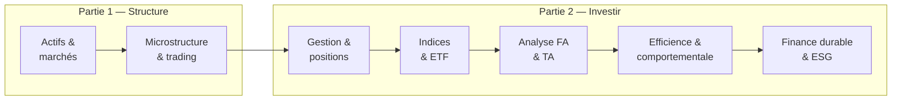

# Financial Markets — Vue d'ensemble

Cours d'Anna Calamia (*Advanced Finance — Financial Markets & Investments*). Il se divise en deux grands blocs.

**Partie 1 — Organisation et structure des marchés.** Comprendre à quoi servent les marchés financiers, qui y intervient, comment les ordres sont exécutés (microstructure), et comment tout cela est régulé.

**Partie 2 — Investir en marchés financiers.** Comment on construit et gère un portefeuille : prendre des positions (longue, courte, à effet de levier), choisir entre gestion active et passive, utiliser indices et ETF, recourir à l'analyse fondamentale ou technique, et le débat central sur l'efficience des marchés et la finance durable.

## Plan du cours

| Chapitre | Contenu clé |
|----------|-------------|
| 1. Actifs & marchés | Types d'actifs et de marchés, participants, fonctions, primaire/secondaire |
| 2. Microstructure & trading | Structures de marché, venues, carnet d'ordres, types d'ordres, coûts, régulation |
| 3. Gestion & positions | Positions longue/courte/levier, gestion active vs passive |
| 4. Indices & ETF | Méthodes de pondération, ETF, investissements alternatifs |
| 5. Analyse fondamentale & technique | Valeur intrinsèque vs signaux de marché |
| 6. Efficience & finance comportementale | EMH, 3 formes, marche aléatoire, anomalies, biais |
| 7. Finance durable & ESG | Stratégies ESG, produits verts, régulation européenne |
