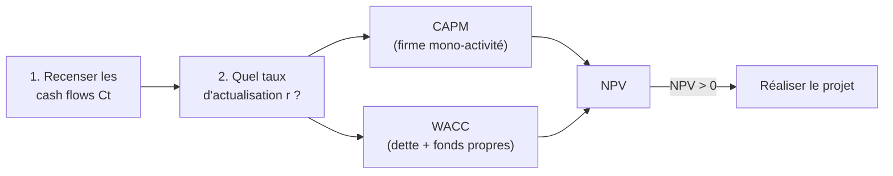
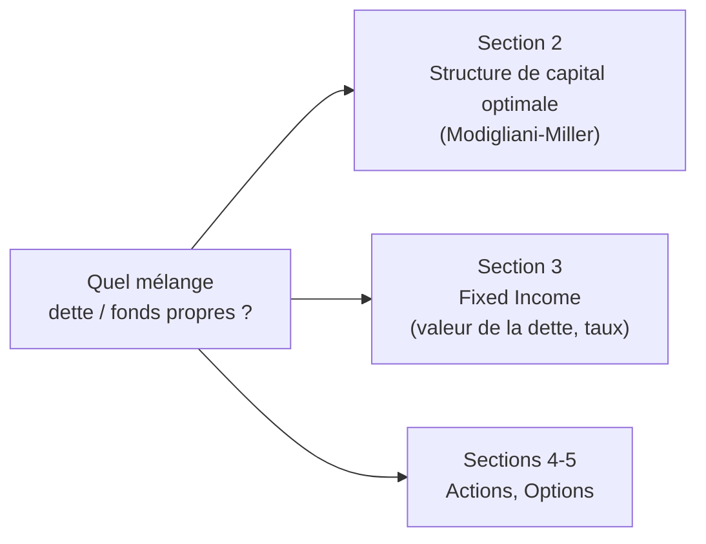

# 1. Investissements & financement

Les cours précédents traitaient surtout de l'**investissement** : quels projets retenir ou rejeter. Ce cours bascule vers le **financement** : comment financer ces projets, et de façon optimale. Cette première section fait le pont entre les deux — elle montre que **la façon de financer un projet change le taux auquel on l'actualise**, donc sa valeur.

## 1. La méthodologie de valorisation d'un projet

Évaluer un projet (*capital budgeting*) suit deux étapes :

1. **Recenser** les décaissements et bénéfices futurs de la décision.
2. **Évaluer la valeur** qu'ils ajoutent.

## 2. Cash flows et valeur actuelle nette (NPV)

Soit \(Cf_t\) le cash flow du projet en année \(t\). La **valeur actuelle nette** au taux \(r\) :

$$
NPV = Cf_0 + \frac{Cf_1}{1+r} + \frac{Cf_2}{(1+r)^2} + \dots + \frac{Cf_T}{(1+r)^T}
$$

Le projet de référence du cours (en milliers USD) :

| Année | 0 | 1 | 2 | 3 | 4 | 5 |
|-------|---:|---:|---:|---:|---:|---:|
| \(Cf_t\) | −34 000 | 11 850 | 11 850 | 7 950 | 7 950 | 11 950 |

À \(r = 5\%\), \(NPV = 10{,}8\) m USD ; à \(r = 7\%\), \(NPV = 8{,}5\) m. La NPV **décroît** quand le taux monte. D'où la question centrale : **quel est le bon taux \(r\) ?**

## 3. Le coût d'opportunité du capital

La logique : si la firme investit l'argent de ses investisseurs dans le projet, ceux-ci ne peuvent plus le placer sur les marchés financiers. Le taux pertinent est donc leur **coût d'opportunité du capital** :

!!! abstract "Définition"
    Le **coût d'opportunité du capital** est le taux de rendement espéré offert par des investissements **équivalents** sur les marchés financiers — équivalents au sens de flux comparables en **timing** et en **risque**.

La NPV est alors la **valeur de marché actuelle** des flux du projet, actualisés au coût d'opportunité du capital — aussi appelé **taux d'actualisation ajusté du risque**. Du point de vue des investisseurs, la NPV est **l'ajout à la valeur de marché de la firme** que procure le projet. La firme doit donc réaliser un projet s'il est plus profitable que des investissements équivalents (NPV > 0).

## 4. Firme mono-titre, mono-activité : le CAPM

Pour estimer ce taux ajusté du risque, on utilise le **CAPM** :

$$
E[\tilde r_{Proj}] = r_f + \beta_{Proj}\,\big(E[\tilde r_m] - r_f\big)
$$

Dans le cas le plus simple — firme **purement financée par fonds propres** (un seul type de titre) et **une seule activité** (le projet est typique de la firme) — tous les investisseurs sont actionnaires et le projet les expose au risque habituel de la firme. Donc :

$$
\beta_{Proj} = \beta_{Equity}
$$

**Exemple.** On estime \(\beta_{Equity} = 0{,}75\) à partir du cours de l'action ; \(r_f = 5\%\) et la prime de marché \(E[\tilde r_m] - r_f = 8\%\). Alors :

$$
E[\tilde r_{Proj}] = 0{,}05 + 0{,}75 \times 0{,}08 = 11\%
$$

À ce taux, \(NPV = 4{,}435\) m USD > 0 → la firme **lance la production**.

## 5. Refléter le financement : fonds propres + dette

Ce raccourci \(\beta_{Proj} = \beta_{Equity}\) ne tient **que si la firme n'a qu'une source de financement**. Dès qu'elle combine **fonds propres et dette**, les investisseurs sont en partie actionnaires, en partie créanciers : le bêta des seuls fonds propres ne reflète plus le risque du projet. Il faut un taux qui **pondère les deux sources**.

## 6. Le coût moyen pondéré du capital (WACC)

Le rendement espéré d'un portefeuille est la moyenne pondérée des rendements de ses composantes. De même, le rendement espéré d'une firme est la moyenne pondérée des rendements de sa dette et de ses fonds propres :

$$
WACC = \frac{D}{D+E}\,E[\tilde r_D] + \frac{E}{D+E}\,E[\tilde r_E]
$$

où \(D\) et \(E\) sont les **valeurs de marché** de la dette et des fonds propres. Le taux ajusté du risque du projet est alors :

$$
E[\tilde r_{Proj}] = WACC
$$

**Exemple.** Fonds propres et dette représentent 80 % et 20 % du capital. \(r_f = 5\%\), \(E[\tilde r_m] = 13\%\) (donc prime de 8 %). La dette est quasi sans risque : \(E[\tilde r_D] = r_f = 5\%\). Le bêta des fonds propres est \(\beta_E = 1{,}1\), d'où :

$$
E[\tilde r_E] = r_f + \beta_E \times 8\% = 5\% + 1{,}1 \times 8\% = 13{,}8\%
$$

$$
WACC = 0{,}80 \times 13{,}8\% + 0{,}20 \times 5\% = 12\%
$$

À ce taux, \(NPV = 3{,}519\) m USD > 0 → on lance la production. Remarque : le levier a fait passer le taux de 11 % (tout fonds propres) à 12 %, donc la NPV de 4,435 à 3,519 m.

!!! warning "WACC ici = avant impôt"
    Dans cette section, le WACC n'intègre **pas** l'économie d'impôt de la dette : la dette entre au taux \(E[\tilde r_D]\), sans facteur \((1-T_c)\). C'est volontaire — le polycopié introduit l'effet fiscal seulement en **Section 2** (Modigliani-Miller avec impôt sur les sociétés). Ne confonds pas avec le WACC *après impôt* \(\frac{D}{V}r_D(1-T_c) + \frac{E}{V}r_e\) utilisé en valorisation (cours Corporate Valuation) : c'est le même objet, à l'étape fiscale près.

Manipule le widget : construis le taux via CAPM/WACC (taux sans risque, prime, bêta, poids, coût de la dette) et observe où il tombe sur le **profil de NPV** du projet, et la NPV qui en résulte.

<iframe src="../../widgets/npv-wacc.html" width="100%" height="620" style="border:0; border-radius:8px;" loading="lazy"></iframe>

## 7. Le choix de financement

On a vu **comment refléter** le financement dans la valorisation. Le cours va maintenant porter sur **comment financer** de façon optimale. Les firmes se financent en émettant des contrats ; les plus courants sont les deux cas extrêmes :

- **Contrat unique — les fonds propres** (*equity*).
- **Contrat simple — la dette** (*debt*).

La question « existe-t-il une proportion **optimale** de dette ? » ouvre la Section 2 (structure de capital, Modigliani-Miller) ; l'impact des fluctuations de taux sur la valeur de la dette ouvre la Section 3 (Fixed Income).
