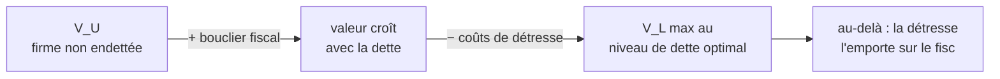

# 2. Structure de capital optimale (Modigliani-Miller)

La **structure de capital** d'une firme désigne la façon dont ses opérations sont financées — sa proportion de dette. La question fondatrice : **la valeur d'une firme dépend-elle de la quantité de dette qu'elle porte ?** Et, en miroir : *un projet peu attrayant peut-il devenir rentable s'il est correctement financé ?*

## 1. Ce qu'on observe dans la réalité

Les ratios dette/actif (D/A) varient fortement selon les pays (USA 0,16 ; Canada 0,26 ; Royaume-Uni 0,08) et plus encore selon les secteurs : Drugs & Cosmetics 0,09, Compagnies aériennes 0,58. Pourquoi les compagnies aériennes s'endettent-elles bien plus que la pharmacie ?

Deux forces expliquent l'essentiel de ces différences :

1. **La fiscalité** : le traitement fiscal de la dette est avantageux par rapport aux fonds propres.
2. **Le coût de la détresse financière** : si les actifs gardent de la valeur en faillite (collatéral élevé), la firme peut emprunter davantage.

(D'autres facteurs — incitations des participants, problèmes de crédibilité — relèvent de cours ultérieurs sur les problèmes d'agence.)

## 2. Proposition I de Modigliani-Miller (sans impôt)

Considérons deux firmes, **U** (non endettée, *unlevered*) et **L** (endettée, *levered*), aux **mêmes opportunités d'investissement** — donc aux mêmes flux de trésorerie \(C_t\) — ne différant que par leur financement.

!!! abstract "Proposition I (sans impôt)"
    En l'absence d'impôt, la valeur de marché des firmes U et L est **identique** :
    $$ V_U = V_L $$
    Il n'existe **pas** de structure de capital optimale. Le financement n'a aucun effet sur la valeur.

**L'intuition (la pizza).** Les flux \(C_t\) sont entièrement déterminés par les décisions d'**investissement** (la technologie, les projets) ; les décisions de **financement** ne les modifient pas. Or financer, c'est seulement **découper** ces flux entre créanciers et actionnaires. Comme le dit Miller : découper la pizza en 4 ou en 8 parts ne change pas la quantité de pizza. La firme U (tout fonds propres) reçoit tous les flux ; la firme L les partage entre dette (\(r D_L\)) et fonds propres (\(C_t - r D_L\)) — la somme est la même.

**La preuve par l'arbitrage.** Si \(V_U > V_L\), un actionnaire détenant une fraction \(\alpha\) de U pourrait vendre ses titres \(\alpha V_U\), répliquer le profil de L en achetant dette **et** fonds propres de L, et dégager un flux strictement supérieur pour tout \(C_t\) — une opportunité d'arbitrage. Les arbitragistes « relèvent » U en empruntant sur leur compte personnel (*homemade leverage*). Symétriquement si \(V_L > V_U\). À l'équilibre, \(V_U = V_L\).

## 3. Le sophisme de la dette bon marché (*cheap debt fallacy*)

MM dérange, car la dette **semble** moins chère que les fonds propres : intérêts ≈ 5 %, rendement attendu des actions ≈ 20 %. Un projet ne devrait-il pas être plus attrayant financé par plus de dette ?

!!! warning "Le piège"
    Non. À mesure que la firme s'endette, **les fonds propres deviennent plus risqués**, donc exigent un rendement plus élevé. Le coût apparemment faible de la dette est une **illusion** : ce qu'on économise sur la dette est exactement compensé par le renchérissement des fonds propres.

## 4. Proposition II : comment le levier affecte le coût du capital

!!! abstract "Proposition II (sans impôt)"
    Le coût moyen pondéré du capital est **constant** :
    $$ WACC = \frac{D}{D+E}\,E[\tilde r_D] + \frac{E}{D+E}\,E[\tilde r_E] = \text{constante} $$
    En résolvant pour le coût des fonds propres :
    $$ E[\tilde r_E] = WACC + \frac{D}{E}\big(WACC - E[\tilde r_D]\big) $$
    Le coût des fonds propres croît **proportionnellement au ratio dette/fonds propres** \(D/E\).

La même logique vaut pour le bêta (le risque systématique de l'actif est constant) :

$$
\beta_A = \frac{D}{D+E}\beta_D + \frac{E}{D+E}\beta_E \qquad\Longrightarrow\qquad \beta_E = \beta_A + \frac{D}{E}(\beta_A - \beta_D)
$$

**Exemple.** Marché : \(r_f = 7\%\), \(E[\tilde r_m] = 13\%\) (prime 6 %). Firme : \(\beta_E = 1\), dette = 20 % du capital, sans risque \(r_D = r_f = 7\%\).

- Coût des fonds propres : \(r_E = 7\% + 1 \times 6\% = 13\%\).
- WACC : \(0{,}2 \times 7\% + 0{,}8 \times 13\% = 11{,}8\%\).
- Bêta de l'actif : \(\beta_A = 0{,}2 \times 0 + 0{,}8 \times 1 = 0{,}8\).

**On passe à 50 % de dette.** Le WACC **reste 11,8 %** ; c'est le coût des fonds propres qui change : \(0{,}5 \times 7\% + 0{,}5 \times r_E = 11{,}8\%\) donne \(r_E = 16{,}6\%\) (et \(\beta_E = 1{,}6\)). **À 75 % de dette**, la dette devient risquée (\(\beta_D = 0{,}5\), donc \(r_D = 10\%\)) : \(\beta_E = 1{,}7\), \(r_E = 17{,}2\%\). À chaque fois, **le WACC et le bêta de l'actif ne bougent pas** — seuls le risque et le rendement des fonds propres montent.

Le widget reproduit exactement cette mécanique : déplace le levier et regarde \(r_E\) grimper pendant que le WACC reste plat (cas sans impôt). Active l'option « impôt » pour voir le WACC se mettre à décroître (section suivante).

<iframe src="../../widgets/mm-leverage.html" width="100%" height="600" style="border:0; border-radius:8px;" loading="lazy"></iframe>

## 5. Structure de capital et impôt sur les sociétés

MM bascule dès qu'on introduit l'impôt. Les **intérêts sont déductibles**, pas les dividendes ni les bénéfices mis en réserve. Sur 1 $ de résultat, à \(\tau_c = 35\%\) : en financement 100 % dette, le bénéficiaire (créancier) reçoit **1,00 $** ; en 100 % fonds propres, l'actionnaire ne reçoit que **0,65 $** après impôt.

Les flux après impôt des deux firmes deviennent :

$$
CF_U = (1 - \tau_c)\,C_t \qquad CF_L = (1 - \tau_c)\,C_t + \tau_c\,(r_D D)
$$

Ils diffèrent du **bouclier fiscal** (*tax shield*) créé par la déductibilité des intérêts : \(\tau_c\,(r_D D)\).

!!! abstract "Proposition I avec impôt"
    $$ V_L = V_U + PV(\text{bouclier fiscal}) $$
    En pratique, l'État paie une fraction \(\tau_c\) des intérêts ; les investisseurs ne peuvent pas obtenir cet avantage fiscal par *homemade leverage*, donc ils paient plus cher pour les firmes endettées.

Le WACC après impôt intègre la déductibilité :

$$
WACC = \frac{E}{D+E}\,E[\tilde r_E] + \frac{D}{D+E}\,E[\tilde r_D]\,(1 - \tau_c)
$$

**Implication brute.** Le ratio \(V(\text{sans dette}) / V(\text{100\% dette}) = 1 - \tau_c = 65\%\) pour \(\tau_c = 35\%\). Pris au pied de la lettre : **la structure optimale serait 100 % de dette !** Conclusion difficile à croire — et la plupart des firmes évitent un endettement aussi extrême. Il doit donc exister un **coût** de la dette, assez substantiel pour contrebalancer le gain fiscal.

## 6. Le coût de la détresse financière

Un fort endettement augmente la probabilité que la firme ne puisse honorer ses obligations → **détresse financière**, voire faillite (liquidation ou réorganisation). Cette détresse est coûteuse :

- **Coûts directs** : frais administratifs, désorganisation des opérations, perte de confiance des clients.
- **Coûts indirects** : contraintes sur la gestion, dégradation des relations clients/fournisseurs, perte de capital humain et d'opportunités de croissance, affaiblissement face aux concurrents, conflits entre parties prenantes. Ils peuvent atteindre **20 % de la valeur** de la firme.

La valeur de liquidation varie selon les secteurs : faible pour le high-tech (actifs intangibles), élevée pour les compagnies aériennes (actifs tangibles).

## 7. La structure de capital optimale (théorie du *trade-off*)

En combinant les deux forces, la valeur de la firme endettée devient :

$$
V_L = V_U + PV(\text{bouclier fiscal}) - PV(\text{coûts de détresse})
$$

La structure **optimale** égalise le **bénéfice fiscal marginal** de la dette et le **coût marginal de détresse**. Ce qui compte n'est pas tant la probabilité de détresse que son **coût** associé, qui dépend du risque des actifs :

- **Faibles coûts de détresse** (actifs tangibles : compagnies aériennes, foncières) → charger la dette pour capter le bouclier fiscal.
- **Forts coûts de détresse** (actifs intangibles : high-tech) → politique d'endettement conservatrice.

En pratique, une firme à forte probabilité de détresse qui doit néanmoins s'endetter devrait privilégier une **dette facile à réorganiser** : des banques plutôt que des porteurs d'obligations dispersés, peu de banques, peu de classes de dette.

!!! note "Synthèse"
    Sans impôt ni problèmes d'information/incitations, la valeur est **indépendante** de la structure de capital (MM). Avec l'impôt sur les sociétés, la valeur **croît** avec le levier (bouclier fiscal). Avec les coûts de détresse, il existe une structure **optimale** mêlant dette et fonds propres. Les problèmes d'information/incitations sont d'autres déterminants importants.
