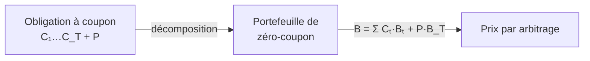

# 3. Fixed Income (obligations)

Les **titres à revenu fixe** sont des créances aux **flux promis d'un montant fixe**, versés à des **dates prédéterminées**. C'est ce caractère contractuel et déterminé qui distingue une obligation d'une action — et qui permet de la valoriser proprement à partir des taux d'intérêt.

## 1. Le paysage des titres souverains

| | États-Unis | Royaume-Uni |
|---|-----------|-------------|
| Court terme sans coupon | T-Bills (3, 6 mois, 1 an), nominal 1 000 $ | T-Bills (3 mois), nominal £100 |
| Coupon semestriel | T-Notes (2–10 ans), T-Bonds (> 10 ans), nominal 1 000 $ | **Gilts** (> 1 an), nominal £1 000 |

Les **gilts** représentent 97 % de la dette du gouvernement britannique. La plupart sont **conventionnels** ; certains sont **indexés sur l'inflation** (*index-linked*, ajustés sur le Retail Prices Index) ou **démembrables** (*strippable* : coupons et principal négociables séparément — *STRIPS*).

## 2. Anatomie d'un gilt conventionnel

Détenir un gilt conventionnel donne droit à une suite de **coupons fixes** sur une période fixe, puis à un **remboursement du capital** à l'échéance. Exemple : £1 000 nominal de **6½ % Treasury Stock 2028**.

- **2028** : année d'échéance (« remboursable au pair le 7 décembre 2028 »). Non remboursable avant, mais cessible à tout moment.
- **£1 000 nominal** : le montant de la créance, **pas** sa valeur actuelle. Un nominal de £1 000 peut valoir plus ou moins de £1 000 sur le marché ; à l'échéance, le détenteur reçoit £1 000.
- **6½ %** : le taux appliqué au nominal pour déterminer le coupon. Payé **semestriellement** : deux versements de £32,50 par an (soit 3¼ % par semestre), les 7 juin et 7 décembre.

## 3. Intérêt couru, prix *clean* et prix *dirty*

Quand on achète une obligation déjà émise, on doit payer la part du prochain coupon **déjà courue**. Achat le 11 mars 2025 d'un 8 % Treasury Stock 2025 : 94 jours après le coupon du 7 décembre 2024, soit un intérêt couru de

$$
8\% \times \tfrac{1}{2} \times \tfrac{94}{182} = 2{,}06593\% \text{ du nominal}
$$

— c'est l'intérêt de **rebate** payé à l'achat (et reçu si l'on vend). On rapporte donc **deux prix** :

!!! abstract "Clean vs Dirty"
    - **Prix *clean*** : hors intérêt couru. C'est le prix **coté** lors de la négociation.
    - **Prix *dirty*** : intérêt couru inclus. C'est le montant **réellement échangé**.

Pour ce gilt : clean £102,92, intérêt couru £2,06593 (pour £100 nominal), **dirty £104,98593**.

## 4. Le rendement à l'échéance (YTM / *redemption yield*)

Le **YTM** \(y\) est le **taux de rendement interne** (TRI) de l'obligation : le taux qui annule la valeur actuelle nette (valeur actuelle des flux promis − prix payé).

$$
B = \frac{C_1}{1+y} + \dots + \frac{C_{T-1}}{(1+y)^{T-1}} + \frac{C_T + P}{(1+y)^T}
$$

Comme les coupons sont le plus souvent **semestriels**, le rendement rapporté est un taux **composé semestriellement**. Pour le 8 % TS 2025, le YTM de **4,031 %** est cohérent avec le prix dirty £104,98593 (l'écart de calcul est de 0,004 %).

## 5. Pourquoi les prix obligataires bougent

Un gilt est sans risque de défaut — pourtant son prix fluctue. La raison n'est **pas** la solvabilité (le gouvernement ne fera pas défaut, le coupon est fixe), mais **les anticipations de taux d'intérêt**.

!!! tip "L'intuition clé"
    Un coupon fixé à 8 % paraît **peu attractif** quand les taux de marché sont à 12 %, et **généreux** quand ils sont à 2 %. Le prix s'ajuste en conséquence. C'est pourquoi le 8 % TS 2025 se traitait à £104,99 (dirty) le 11 mars 2025 : avec des taux autour de 4 %, le coupon de 8 % était généreux, donc le prix bien **au-dessus du pair** (£100). Surtout, le prix reflète la vue **collective** du marché sur l'évolution **future** des taux sur la durée de vie restante.

Le widget illustre cette relation **prix ↔ rendement** : déplace le YTM et observe le prix. Quand YTM < coupon → **prime** (prix > pair) ; YTM = coupon → **pair** ; YTM > coupon → **décote**. La courbe est décroissante et convexe.

<iframe src="../../widgets/bond-price-yield.html" width="100%" height="580" style="border:0; border-radius:8px;" loading="lazy"></iframe>

## 6. Taux spot et structure par terme

Le **taux spot** \(r_t\) est le taux (annualisé) utilisé par le marché pour valoriser **un seul** paiement sans risque à la date future \(t\). Il est différent pour chaque échéance \(t\). L'ensemble \(\{r_1, r_2, \dots\}\) forme la **structure par terme des taux** (*term structure*) — la relation entre taux spot et maturités. Au 20 août 2025, la courbe des taux UK montait de ~4,07 % (1 mois) à 5,55 % (30 ans) : une courbe **croissante**.

## 7. Obligations zéro-coupon (*discount bonds*)

Le titre le plus simple : il paie 1 $ (ou £1) à la seule date \(t\). Son prix actuel est le **facteur d'actualisation** :

$$
B_t = \frac{1}{(1+r_t)^t}
$$

Au 20 août 2025, \(r_5 = 4{,}09\%\) donc \(B_5 = 1/(1{,}0409)^5 = 0{,}8184\). Coter les prix de zéro-coupon revient exactement à coter les taux spot — c'est la même information.

## 8. Obligations à coupon = portefeuille de zéro-coupon

Une obligation à coupon promet \(\{C_1, \dots, C_T\}\) plus le principal \(P\) en \(T\). Elle a **exactement les mêmes flux** qu'un portefeuille de zéro-coupon (\(C_t\) unités d'échéance \(t\), plus \(P\) unités d'échéance \(T\)). Par **arbitrage**, son prix doit donc être :

$$
B = \frac{C_1}{(1+r_1)} + \dots + \frac{C_T + P}{(1+r_T)^T} = C_1 B_1 + \dots + C_T B_T + P\,B_T
$$

**Exemple.** Obligation UK, principal £1 000, coupons £50 sur 5 ans. Avec les prix de zéro-coupon ci-dessus, \(B = 50(B_1+\dots+B_4) + 1050\,B_5 = \pounds 1\,041\).

## 9. YTM d'un zéro-coupon = taux spot

Cas particulier : le YTM d'un zéro-coupon d'échéance \(t\) vérifie \(B_t = 1/(1+y_t)^t\), donc \(y_t = r_t\). Tracer le YTM des zéro-coupon contre la maturité **redonne la structure par terme** — c'est pourquoi on l'appelle aussi la **courbe des taux** (*yield curve*).

## 10. L'incohérence du YTM

Le YTM est commode mais **conceptuellement bancal** : il actualise **tous** les flux d'une obligation au **même** taux \(y\), alors que des flux à des dates différentes devraient être actualisés à des taux **différents** (les taux spot).

!!! warning "À comprendre pour l'examen"
    Avec les taux spot \(r_1 = 10\%, r_2 = 12\%, r_3 = 14\%\) : une obligation 2 ans à 8 % vaut 93,4 $ (YTM 11,9 %) ; une obligation 3 ans à 10 % vaut 91,3 $ (YTM 13,7 %). Les **deux YTM diffèrent** alors que la courbe spot est la **même** — parce que les deux obligations ont des échéanciers de flux différents. La méthode **correcte et cohérente** actualise chaque flux à son **taux spot** : flux d'une même date → même taux ; flux de dates différentes → taux différents. Le YTM, lui, est propre à chaque obligation.

!!! note "Vers la suite"
    La valorisation par flux actualisés au coût du capital (Section 1) et par taux spot (ici) prépare les sections **Actions** (4) et **Options** (5), qui appliquent la même logique d'arbitrage à d'autres contrats.
