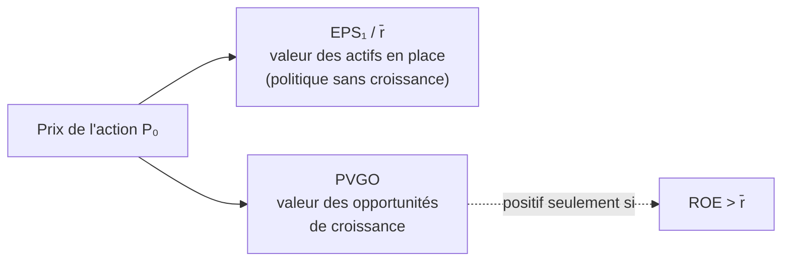

# 4. Actions (Stocks)

Une action (*common stock*) représente une part de **propriété** d'une entreprise. Contrairement aux paiements aux créanciers, les **dividendes** sont incertains en montant et en date. L'actionnaire a une **créance résiduelle** (après les créanciers), une **responsabilité limitée** (il ne peut perdre plus que sa mise) et des **droits de vote**. Toute la question est : combien vaut cette action ?

## 1. La valorisation par les dividendes (DDM)

Sur un an, le rendement espéré d'une action se décompose en **rendement du dividende** et **plus-value attendue** :

$$
E_0[\tilde r] = \frac{E_0[\tilde D_1]}{P_0} + \frac{E_0[\tilde P_1] - P_0}{P_0}
$$

En réarrangeant puis en substituant le prix futur de proche en proche (le prix de l'an prochain dépend lui-même du dividende et du prix de l'année suivante…), on obtient le **modèle d'actualisation des dividendes** :

$$
P_0 = \sum_{t=1}^{\infty} \frac{E_0[\tilde D_t]}{(1+\bar r)^t}
$$

C'est la **même méthodologie NPV** que partout ailleurs : actualiser les flux espérés à un taux ajusté du risque. Deux ingrédients suffisent : (a) les **dividendes futurs** espérés, (b) le **taux d'actualisation** \(\bar r = E_0[\tilde r]\), obtenu par le **CAPM** : \(\bar r = r_f + \beta(E_0[\tilde r_m] - r_f)\).

!!! note "Pas besoin de détenir l'action « pour toujours »"
    La validité du calcul n'exige pas de garder l'action indéfiniment : si on la revend, son prix de revente est lui-même la valeur actualisée des dividendes suivants. Tout se ramène aux dividendes.

## 2. Le modèle de Gordon (croissance constante)

Si les dividendes croissent à un taux constant \(g < \bar r\) à perpétuité, la somme se ramène à une perpétuité croissante :

$$
P_0 = \frac{E_0[\tilde D_1]}{\bar r - g} = \frac{(1+g)\,D_0}{\bar r - g}
$$

!!! example "Exemple"
    Dividende courant 1 $, croissance 6 %, \(\bar r = 20\%\) : \(P_0 = \dfrac{1{,}06 \times 1}{0{,}20 - 0{,}06} = 7{,}57\,\$\).

La relation lie quatre grandeurs (prix, dividende, croissance, rendement) : en connaissant trois, on déduit la quatrième. Ainsi le **rendement implicite** : pour Acer, \(D_0/P_0 = 5{,}2\%\) et \(g = 4{,}9\%\) donnent \(\bar r = (1+g)\frac{D_0}{P_0} + g = 10{,}35\%\).

## 3. Croissance multi-étapes

Les firmes traversent des **stades** : croissance (ventes en forte expansion, marges élevées, peu de dividendes), transition (croissance et marges érodées par la concurrence, payout en hausse), maturité (croissance, payout et rendement stabilisés). On valorise alors par morceaux. Exemple : dividende 1 $, \(\bar r = 20\%\), croissance 6 % pendant 7 ans puis nulle → \(P_0 = 6{,}49\,\$\) (annuité croissante sur 7 ans + perpétuité actualisée).

## 4. Les ratios qui alimentent le modèle

| Ratio | Définition |
|-------|-----------|
| Payout \(p\) | dividende / résultat = DPS/EPS |
| Plowback \(b\) | bénéfices réinvestis / résultat = \(1 - p\) |
| ROE | résultat / valeur comptable (BV) |
| Croissance \(g\) | \(g = ROE \times b\) |
| Dividende \(D_1\) | \(D_1 = EPS_1 \times p\) |

La croissance soutenable vient donc du **réinvestissement** : \(g = ROE \times b\). Plus on réinvestit (b élevé), plus on croît — **à condition** que ce réinvestissement rapporte.

## 5. Croissance et nouveaux investissements : l'exemple Dell

Dell gagne 1 $/action l'an prochain, valeur comptable 10 $, programme d'investissement +8 %/an financé par les bénéfices retenus, taux et rendement des nouveaux investissements **tous deux à 10 %**.

- Plowback \(b = (10 \times 0{,}08)/1 = 0{,}8\) ; payout \(p = 0{,}2\) ; \(ROE = 1/10 = 0{,}1\).
- \(g = ROE \times b = 0{,}08\) ; \(D_1 = 1 \times 0{,}2 = 0{,}2\) ; \(P_0 = \dfrac{0{,}2}{0{,}10 - 0{,}08} = 10\,\$\).

Si l'expansion **ralentit** à 4 % après l'année 5, en prévoyant EPS, dividendes et BV année par année, on retrouve… **exactement 10 $**.

!!! warning "Pourquoi la même valeur ? (question d'examen)"
    Parce que les nouveaux investissements rapportent **exactement le coût du capital** (\(ROE = \bar r = 10\%\)). Ils ont une **NPV nulle** : croître ou non ne change rien à la valeur. **La croissance ne crée de la valeur que si elle est rentable au-delà du coût du capital.**

## 6. Opportunités de croissance et PVGO

Une **opportunité de croissance** est un investissement dont le rendement espéré **dépasse** le taux requis. Les entreprises qui y ont accès sont des **valeurs de croissance** (*growth stocks* : IBM années 60-70, Microsoft 80-90, Google 2000s).

!!! example "ABC Software"
    \(EPS_1 = 8{,}33\,\$\), payout \(p = 0{,}6\), \(ROE = 25\%\), \(\bar r = 15\%\).
    **Politique actuelle :** \(b = 0{,}4\), \(g = 0{,}25 \times 0{,}4 = 10\%\), \(D_1 = 5\,\$\) → \(P_0 = \dfrac{5}{0{,}15 - 0{,}10} = 100\,\$\).
    **Sans croissance** (tout en dividende, \(p = 1, g = 0\)) : \(P_0 = \dfrac{8{,}33}{0{,}15} = 55{,}56\,\$\).
    L'écart **44,44 $** vient des opportunités de croissance qui rapportent 25 % > 15 %.

Cet écart se reconstruit flux par flux. La 1ʳᵉ année, la firme distribue \(EPS_1 \times b = 3{,}33\,\$\) de moins pour réinvestir ; ce placement à 25 % crée une perpétuité de \(0{,}83\,\$\), d'où \(NPV_1 = -3{,}33 + \dfrac{0{,}83}{0{,}15} = 2{,}22\,\$\). Ces NPV croissent à \(g\), donc :

$$
PVGO = \frac{NPV_1}{\bar r - g} = \frac{2{,}22}{0{,}15 - 0{,}10} = 44{,}44\,\$
$$

## 7. Prix, EPS et P/E

On décompose alors tout prix d'action en **valeur sans croissance** + **valeur des opportunités de croissance** :

$$
P_0 = \frac{EPS_1}{\bar r} + PVGO
$$

D'où les relations sur le **rendement bénéficiaire** \(E/P\) et le **P/E** :

$$
\frac{E}{P} = \bar r\left(1 - \frac{PVGO}{P_0}\right) \qquad \frac{P}{E} = \frac{1}{\bar r} + \frac{PVGO}{EPS_1}
$$

- Si \(PVGO = 0\) : \(E/P = \bar r\) (le rendement bénéficiaire égale le rendement requis).
- Si \(PVGO > 0\) : \(E/P < \bar r\), et le **P/E est élevé** — à secteur comparable, un P/E plus haut signale une **croissance attendue** plus forte.
- **PVGO > 0 si et seulement si \(ROE > \bar r\)** : la croissance ne vaut que si la firme gagne plus que son coût du capital.

Le widget relie tout cela : fais varier le payout (donc le réinvestissement) et le ROE, et regarde la décomposition prix = valeur sans croissance + PVGO. Le point clé apparaît immédiatement : quand ROE < r̄, **réinvestir détruit** de la valeur (PVGO négatif).

<iframe src="../../widgets/gordon-pvgo.html" width="100%" height="620" style="border:0; border-radius:8px;" loading="lazy"></iframe>
