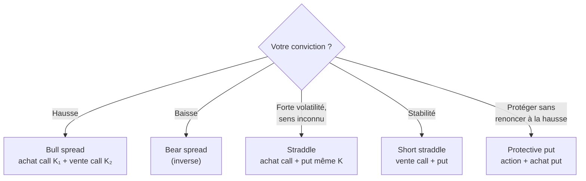

# 5. Options

Une **option** donne un **droit, pas une obligation**. C'est ce qui la distingue de tous les contrats vus jusqu'ici et qui rend son payoff asymétrique — d'où une logique de valorisation par arbitrage et réplication.

## 1. Définitions

- **Call** : droit d'**acheter** l'actif sous-jacent à un prix fixé (prix d'exercice), à ou avant une date donnée.
- **Put** : droit de **vendre** l'actif à un prix fixé, à ou avant une date donnée.
- **Européenne** : exerçable **seulement** à l'échéance. **Américaine** : exerçable **à tout moment** jusqu'à l'échéance.

Quatre éléments définissent une option : le sous-jacent et son prix \(S\), le prix d'exercice (*strike*) \(K\), la date d'échéance \(T\), et le type (européenne/américaine).

## 2. Payoff à l'échéance

Le payoff dépend du prix du sous-jacent \(S_T\) à l'échéance. Pour un call de strike \(K\), le détenteur exerce seulement si \(S_T > K\) :

$$
\text{Call} : \max(S_T - K,\, 0) \qquad \text{Put} : \max(K - S_T,\, 0)
$$

!!! note "Le payoff n'est jamais négatif"
    Détenir une option ne peut pas coûter à l'échéance (c'est un droit, pas une obligation) — d'où max(·, 0). Le payoff est parfois positif, jamais négatif. Le profit, lui, retranche la prime payée à l'achat.

Le widget ci-dessous trace le profit à l'échéance pour différentes stratégies — commence par un simple call/put pour voir l'asymétrie.

<iframe src="../../widgets/option-payoff.html" width="100%" height="600" style="border:0; border-radius:8px;" loading="lazy"></iframe>

## 3. La parité put-call

En comparant deux portefeuilles aux payoffs identiques, on obtient une relation incontournable entre call et put européens de mêmes caractéristiques.

| | Investissement (t) | Si \(S_T \le K\) | Si \(S_T > K\) |
|---|---|---|---|
| **Portefeuille A** : call + obligation (valeur faciale K) | \(c_t + PV[K]\) | \(0 + K\) | \((S_T - K) + K\) |
| **Portefeuille B** : put + 1 action | \(p_t + S_t\) | \((K - S_T) + S_T\) | \(0 + S_T\) |
| Payoff total | | \(K\) | \(S_T\) |

Les deux portefeuilles ont **le même payoff** en \(T\), donc la même valeur aujourd'hui :

!!! abstract "Parité put-call"
    $$ c_t + K\,e^{-r(T-t)} = p_t + S_t $$
    Connaissant le prix du call, on déduit immédiatement celui du put (et inversement). Une violation de cette égalité ouvre une opportunité d'**arbitrage**.

## 4. Stratégies optionnelles

- **Bull spread** (optimisme) : acheter un call à \(K_1\), vendre un call à \(K_2 > K_1\). Coûteux au départ (\(C_1 > C_2\)) ; profite d'une hausse, à gain plafonné.
- **Straddle** (pari sur la volatilité) : acheter un call **et** un put de même strike \(K \approx S\). Profite d'un mouvement **important, quel qu'en soit le sens** (élections, technologie de rupture…). À l'inverse, le **short straddle** (vente des deux) profite de la **stabilité**.
- **Protective put** (couverture) : détenir l'action **et** acheter un put. On couvre le risque de baisse tout en gardant le potentiel de hausse.

## 5. Statique comparative : les 6 facteurs

Six variables déterminent le prix d'une option. Voici leur effet d'une **hausse** de chacune (toutes choses égales par ailleurs) :

| Variable ↑ | Call EU | Call US | Put EU | Put US |
|------------|:------:|:------:|:-----:|:-----:|
| Prix du sous-jacent \(S_t\) | + | + | − | − |
| Prix d'exercice \(K\) | − | − | + | + |
| Échéance \(T-t\) | ? | + | ? | + |
| Taux sans risque \(r\) | + | + | − | − |
| Dividendes \(D\) | − | − | + | + |
| Volatilité \(\sigma\) | + | + | + | + |

Quelques intuitions clés :

- **\(S\) et \(K\)** : le payoff d'un call est \(S_T - K\), donc il monte quand \(S\) monte et \(K\) baisse.
- **Échéance** : une option **américaine** longue contient toutes les possibilités d'exercice de la courte, plus d'autres → plus longue = plus chère. Pour les **européennes**, ce n'est pas emboîté : avec dividendes, une option courte peut valoir **plus** qu'une longue.
- **Taux sans risque** : une hausse de \(r\) baisse la valeur actuelle du strike à payer → **augmente** le call, **baisse** le put.
- **Dividendes** : leur versement fait baisser le cours → effet d'une baisse de \(S\).
- **Volatilité** : plus σ est élevée, plus les prix extrêmes sont probables ; le détenteur du call profite de la hausse **sans subir** la baisse (payoff plancher à 0). Donc **plus de volatilité = option plus chère**, call comme put.

## 6. Options américaines et exercice anticipé

En comparant un call européen (portefeuille 1) à « une action financée par un emprunt de \(Ke^{-rT}\) » (portefeuille 2), on montre \(c(S_t) > S_t - Ke^{-r(T-t)}\). Comme une américaine vaut au moins l'européenne, \(C(S_t) > S_t - K\).

!!! tip "Théorème (point d'examen)"
    Il n'est **jamais optimal d'exercer par anticipation un call américain sur une action sans dividende** : mieux vaut le vendre que l'exercer (on perdrait la valeur temps et l'avantage de différer le paiement du strike). Le résultat **ne tient pas** pour le put : un put américain suffisamment **dans la monnaie** peut être exercé par anticipation.

## 7. La formule de Black-Scholes

Le couronnement : le prix d'un call européen (sans dividende).

!!! abstract "Formule de Black-Scholes"
    $$ C(S_t \mid T, K) = S_t\,\Phi\big[d_1\big] - K\,e^{-r(T-t)}\,\Phi\big[d_2\big] $$
    $$ d_1 = \frac{\ln(S_t/K) + (r + \sigma^2/2)(T-t)}{\sigma\sqrt{T-t}}, \qquad d_2 = d_1 - \sigma\sqrt{T-t} $$
    où \(\Phi[\cdot]\) est la fonction de répartition de la loi normale centrée réduite.

!!! example "Exemple"
    \(S_t = 40{,}75\,\$\), \(K = 40\,\$\), 133 jours à courir (\(T-t = 133/365\)), \(r = 3{,}81\%\), \(\sigma = 52\%\). On calcule \(d_2 = -0{,}0535\), \(d_1 = 0{,}2604\), puis \(C = 40{,}75\,\Phi[0{,}2604] - 40\,e^{-0{,}0381 \times 0{,}3644}\,\Phi[-0{,}0535] = \mathbf{5{,}68\,\$}\).

!!! note "Le point remarquable"
    Au-delà des données contractuelles et de la **volatilité**, la seule donnée de marché nécessaire est le **taux sans risque** — facile à obtenir, **sans recourir au CAPM**. C'est la magie de la valorisation par arbitrage (réplication) : le rendement espéré du sous-jacent n'intervient pas.

Le widget ci-dessous applique Black-Scholes et en déduit le put par parité — fais varier la volatilité pour vérifier la statique comparative (σ ↑ → call **et** put ↑).

<iframe src="../../widgets/black-scholes.html" width="100%" height="580" style="border:0; border-radius:8px;" loading="lazy"></iframe>

!!! note "Fin du polycopié"
    Les cinq sections forment un tout : valoriser et financer un investissement (1), choisir une structure de capital (2), puis valoriser les trois grands contrats — dette (3), actions (4) et options (5) — par la même logique d'actualisation et d'arbitrage.
