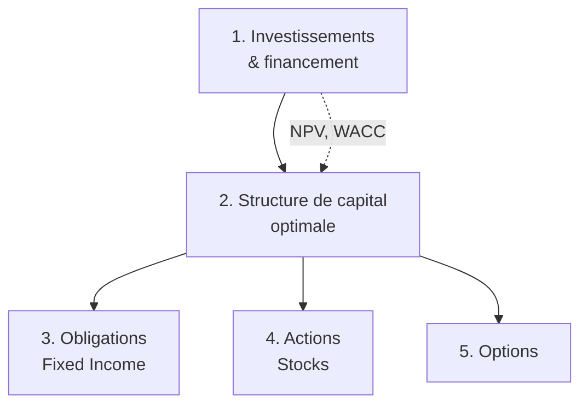

# Financing & Financial Securities — Vue d'ensemble

Cours de Pierre Mella-Barral & Roman Skripnik (*M1 — PSM Finance*). Il prolonge les *Fundamentals of Finance* : on passait de « comment valoriser un investissement » à « **comment le financer** » — méthodes et instruments de financement.

## Plan du cours

| Section | Notions centrales |
|---------|-------------------|
| 1. Investissements & financement | Cash flows et NPV, firme mono-activité, fonds propres et dette, WACC, choix de financement |
| 2. Structure de capital optimale | Propositions de Modigliani-Miller, *cheap debt fallacy*, effet du levier sur le coût du capital, économie d'impôt de la dette, coûts de détresse financière, théorie du *trade-off* |
| 3. Fixed Income | Évaluation des obligations, taux, risque de crédit |
| 4. Stocks | Évaluation des actions, dividendes, croissance |
| 5. Options | Bases de la théorie des options et applications au financement |

!!! note "Statut"
    Ce cours est un polycopié de 219 pages, dense en démonstrations. Il sera développé **section par section** pour conserver la profondeur (dérivations complètes, intuition, exemples chiffrés). La section 1 ouvre la série.
