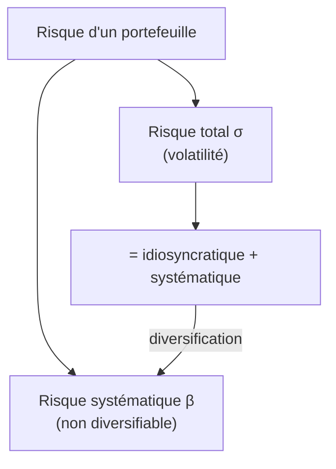

# 2. Rendements ajustés au risque

Un rendement de 10 % obtenu en prenant beaucoup de risque ne vaut pas un 10 % obtenu prudemment. Les mesures de rendement brut ne disent rien du **risque accepté** par le gérant. D'où une famille de mesures **ajustées au risque** — qui diffèrent surtout par la **définition du risque** qu'elles rémunèrent.

## 1. Deux risques : total vs systématique

Le **risque idiosyncratique** (spécifique à une entreprise) s'élimine par diversification ; au-delà d'une vingtaine de titres, il ne reste que le **risque de marché (systématique)**, capté par le bêta. Selon la mesure choisie, on rémunère le risque **total** (σ) ou seulement le risque **systématique** (β).

## 2. Ratio de Sharpe (risque total)

$$
SR = \frac{R_P - r_f}{\sigma_P}
$$

Excès de rendement par unité de **volatilité totale**. C'est la mesure qui s'appuie le moins sur le CAPM. Plus il est élevé, mieux c'est.

!!! example "Exemple"
    Deux gérants à 10 % de rendement, \(r_f = 4\%\). A : σ = 8 % → SR = 0,75. B : σ = 6 % → SR = **1,0**. B est supérieur en rendement ajusté du risque.

**Sharpe espéré et pente de la CAL.** Calculé sur des rendements **espérés**, \(E[SR] = (E[R_P]-r_f)/\sigma_P\) est exactement la **pente de la *Capital Allocation Line*** passant par P (voir chapitre 3). Maximiser le Sharpe espéré, c'est trouver le portefeuille de **pente maximale** — la tangence.

## 3. M² de Modigliani (risque total, en points de rendement)

Le Sharpe classe les portefeuilles mais sa valeur numérique est peu parlante (un écart de 0,04 est-il grand ?). Le **M²** traduit le Sharpe en **points de rendement** comparables au marché : on forme un portefeuille ajusté Q\* mélangeant Q et l'actif sans risque pour **égaler la volatilité du marché**, puis :

$$
M^2 = R_{Q^*} - R_M = (SR_Q - SR_M)\,\sigma_M
$$

Sharpe et M² donnent **le même classement** (M² n'est que l'écart de Sharpe mis à l'échelle de σ_M).

!!! example "Exemple"
    Q : \(R = 35\%, \sigma = 42\%\) ; marché : \(28\%, 30\%\) ; \(r_f = 6\%\). \(SR_Q = 0{,}69\), \(SR_M = 0{,}73\). \(M^2 = (0{,}69 - 0{,}73)\times 30\% \approx -1{,}3\%\) : Q fait 1,3 point de **moins** que le marché à volatilité égale.

## 4. Ratio de Sortino (risque de baisse)

$$
\text{Sortino} = \frac{R_P - r_f}{\sigma_D}
$$

Variante du Sharpe qui ne pénalise que la **volatilité à la baisse** \(\sigma_D\) (*semi-variance*) : l'idée est que l'investisseur ne craint pas la volatilité haussière, seulement les pertes.

## 5. Ratio de Treynor (risque systématique)

$$
T_P = \frac{R_P - r_f}{\beta_P}
$$

Excès de rendement par unité de risque **systématique**. Fondé sur le CAPM, il convient aux **grands portefeuilles bien diversifiés** (où l'idiosyncratique a disparu).

!!! example "Exemple"
    Mêmes gérants qu'au §2 ; β_A = 1,0, β_B = 1,2. \(T_A = (10-4)/1{,}0 = 6\%\), \(T_B = (10-4)/1{,}2 = 5\%\). Cette fois **A est supérieur** — car on juge le risque systématique, pas total.

!!! warning "Sharpe et Treynor peuvent diverger"
    Portefeuille A : excès 18 %, β 1,2, σ 25 % → Sharpe 0,72, Treynor 15 %. Marché : excès 12 %, β 1,0, σ 15 % → Sharpe 0,80, Treynor 12 %. A est **inférieur au marché comme placement unique** (Sharpe plus faible), mais il est **au-dessus de la SML** (Treynor plus élevé) : il serait un **bon ajout** à un portefeuille déjà diversifié. Sharpe juge un placement isolé ; Treynor juge une brique d'un ensemble diversifié.

## 6. Alpha de Jensen (CAPM)

L'**alpha** est la surperformance au-delà de ce que le CAPM justifie compte tenu du bêta :

$$
\alpha_P = R_P - \big[\,r_f + \beta_P (R_M - r_f)\,\big]
$$

!!! example "Exemple"
    P : \(R = 35\%, \beta = 1{,}2, r_f = 6\%\), marché 28 %. CAPM : \(6\% + 1{,}2(28\%-6\%) = 32{,}4\%\). \(\alpha = 35\% - 32{,}4\% = +2{,}6\%\) : P a battu sa droite de marché de 2,6 points.

## 7. Information Ratio (risque actif)

$$
IR = \frac{\alpha_P}{\sigma(\varepsilon_P)} = \frac{R_P - R_b}{TE}
$$

Surperformance active rapportée au **risque actif** (tracking error \(TE\), écart-type de l'écart au benchmark). Il mesure l'efficacité du gérant à générer de l'alpha par unité de pari pris contre l'indice.

Le widget calcule ces mesures à partir des données d'un portefeuille — les valeurs par défaut reproduisent le portefeuille Q des exemples.

<iframe src="../../widgets/risk-adjusted.html" width="100%" height="560" style="border:0; border-radius:8px;" loading="lazy"></iframe>

!!! note "Quelle mesure choisir ?"
    Risque **total** (placement isolé, gérant non forcément diversifié) → **Sharpe / M² / Sortino**. Risque **systématique** (grand portefeuille diversifié, brique d'un ensemble) → **Treynor / alpha**. Pari **actif** contre un benchmark → **Information Ratio**.
