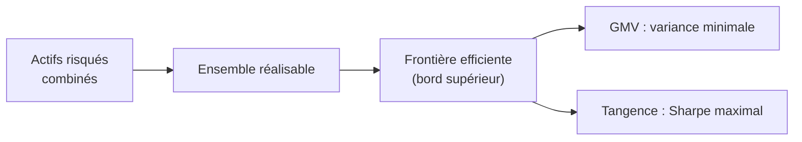

# 3. Frontière efficiente, CAL & CML

Ce chapitre relie la mesure de performance à la **théorie du portefeuille** : comment, en combinant des actifs risqués et un actif sans risque, on construit l'ensemble des portefeuilles optimaux — et pourquoi le ratio de Sharpe en est la clé géométrique.

## 1. La frontière efficiente des actifs risqués

En combinant des actifs risqués dans toutes les proportions possibles, on obtient un ensemble de portefeuilles réalisables, borné par une courbe. La **frontière efficiente** est sa partie supérieure : pour chaque niveau de risque σ, le portefeuille qui offre le **rendement espéré maximal** (ou, pour chaque rendement, le risque minimal). Son point le plus à gauche est le **portefeuille de variance minimale** (GMV).

## 2. L'actif sans risque et la Capital Allocation Line

Prêter ou emprunter au taux sans risque \(r_f\) permet de créer des portefeuilles **hors** de la frontière des seuls actifs risqués. En combinant \(r_f\) et un portefeuille risqué P, on décrit une **droite** dans l'espace (σ, rendement) : la **Capital Allocation Line (CAL)** de P.

$$
E[r] = r_f + \underbrace{\frac{E[R_P]-r_f}{\sigma_P}}_{\text{pente} \,=\, E[SR_P]}\;\sigma
$$

La **pente de la CAL est exactement le ratio de Sharpe espéré** de P. Donc : choisir le meilleur portefeuille risqué revient à choisir la CAL **la plus pentue**.

## 3. Le portefeuille optimal (tangence) et la CML

La CAL la plus pentue est celle qui devient **tangente** à la frontière efficiente. Son point de tangence est le **portefeuille risqué optimal** — celui de **Sharpe maximal**. Tous les investisseurs (sous les hypothèses du CAPM) détiennent ce même portefeuille risqué, complété par plus ou moins d'actif sans risque selon leur tolérance au risque (*théorème de séparation*).

Quand ce portefeuille de tangence est le **portefeuille de marché M**, la CAL devient la **Capital Market Line (CML)** :

$$
E[r] = r_f + \frac{E[R_M]-r_f}{\sigma_M}\,\sigma
$$

Le widget rend tout cela manipulable : la frontière (à deux actifs), la CML issue de \(r_f\), le **point de tangence (Sharpe max)** et le GMV. Fais varier la corrélation ρ pour voir la frontière se creuser et la diversification opérer.

<iframe src="../../widgets/efficient-frontier.html" width="100%" height="560" style="border:0; border-radius:8px;" loading="lazy"></iframe>

## 4. Du portefeuille au titre : la SML et le CAPM

La **CML** valorise des **portefeuilles efficients** en fonction de leur risque **total** σ. Pour un **titre individuel**, seul le risque **systématique** (β) est rémunéré (l'idiosyncratique se diversifie) : on passe à la **Security Market Line (SML)**, c'est-à-dire le **CAPM** :

$$
E[r_i] = r_f + \beta_i\,(E[r_M] - r_f)
$$

Le rendement espéré d'un actif dépend de trois choses : la **valeur temps pure** de l'argent (\(r_f\)), la **prime de risque de marché** \((E[r_M]-r_f)\), et la **quantité de risque de marché** (β).

!!! warning "CML vs SML — ne pas confondre"
    Même idée (rémunérer le risque), abscisses différentes : la **CML** est tracée contre le **risque total σ** et ne concerne que les portefeuilles **efficients** ; la **SML** est tracée contre le **bêta β** et concerne **tout** actif ou portefeuille. Un titre peut être sous la CML (sous-optimal isolément) tout en étant sur la SML (correctement valorisé) — c'est le cas du portefeuille A vu au chapitre précédent.

## 5. Les hypothèses du CAPM

Le CAPM repose sur des hypothèses fortes : actifs cotés, divisibles, offre fixe et **actif sans risque** ; investisseurs **optimisateurs moyenne-variance**, à **anticipations homogènes**, même horizon, atomistiques ; marchés **sans coûts de transaction**, sans restriction d'emprunt ou de vente à découvert, sans impôt, information libre et simultanée. Irréalistes prises au pied de la lettre, elles fournissent le **cadre de référence** qui relie risque systématique et rendement espéré.

!!! note "Le fil rouge"
    Sharpe (pente de la CAL) → tangence (Sharpe max) → CML (portefeuille de marché) → SML/CAPM (titre individuel). Les mesures de performance du chapitre 2 ne sont pas des recettes isolées : ce sont les coordonnées de cette même géométrie risque-rendement.
