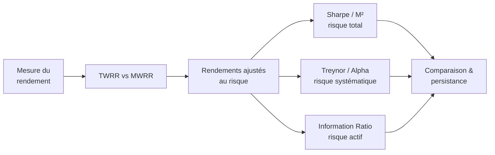

# Portfolio Management — Vue d'ensemble

Cours de gestion de portefeuille. La Partie 1 confirmée porte sur l'**évaluation de performance** : mesurer correctement le rendement d'un portefeuille, puis l'ajuster au risque pour comparer des stratégies entre elles.

## Plan du cours

| Bloc | Notions centrales |
|------|-------------------|
| Mesure du rendement | Rendement pondéré par le temps (TWRR) vs par les flux (MWRR), choix selon le contrôle des flux |
| Risque total | Ratio de Sharpe, mesure M² de Modigliani |
| Risque systématique | Beta, ratio de Treynor, alpha de Jensen (CAPM) |
| Risque actif | Tracking error, Information Ratio |
| Au-delà | Persistance de la performance, biais de survie, théorie du portefeuille (frontière efficiente, CML) |

!!! note "Statut"
    Onglet en place. Le contenu détaillé sera développé chapitre par chapitre (avec un widget de frontière efficiente déjà prêt à être rebranché).
